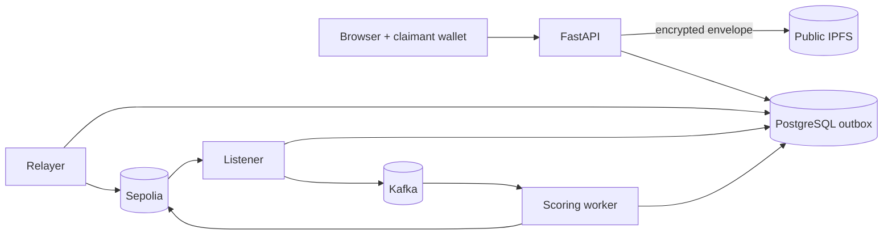

# Running the complete application locally

This guide starts the complete gasless claims workflow on a local macOS or Linux
machine. “Local” describes where the application processes run. Claim anchors
still use the public Sepolia test network, and encrypted claim envelopes still
go to public IPFS through Pinata.

> Use fictional data and test wallets only. Never paste a mainnet wallet key,
> real policy information, or personal evidence into this application.

## What you are starting

The application is not one server. It is a small event-driven system made of
independent processes:

| Process             | Why it exists                                                  | Keep it running? |
| ------------------- | -------------------------------------------------------------- | ---------------- |
| PostgreSQL          | Durable gasless outbox, index, assessments, governance proposals and checkpoints | Yes |
| Kafka               | Carries verified claim references to the scoring worker        | Yes              |
| FastAPI             | Verifies claimant sessions/policies, issues permits and prepares EIP-712 data | Yes |
| React/Vite          | Browser UI and claimant-wallet signature flow                  | Yes              |
| Gasless relayer     | Pays Sepolia gas for authorized requests                       | Yes              |
| Blockchain listener | Converts confirmed contract logs into the local index          | Yes              |
| Scoring worker      | Verifies, enriches and scores claims, then writes assessment   | Yes              |

The order matters. Infrastructure and migrations must exist before the API,
relayer, listener, or worker tries to use them.



## 1. Check prerequisites

Install:

- Python 3.13;
- Node.js 24 and npm;
- Docker Desktop (or Docker Engine with Compose);
- an EIP-1193 browser wallet such as MetaMask;
- a Sepolia RPC URL;
- a Pinata JWT; and
- fictional Sepolia wallets for insurer, permit issuer, claimant, assessor,
  relayer, coverage decision maker, and offline admin
  roles.

Check the local tools:

```bash
python3 --version
node --version
npm --version
docker --version
docker compose version
```

On macOS, install OpenMP before loading XGBoost:

```bash
brew install libomp
```

All remaining commands assume this repository root:

```bash
cd <folder_directory>Decentralized-Claims-Registry
```

## 2. Install Python and Node dependencies

Create one Python environment shared by the backend, listener, relayer, worker,
and command-line tools:

```bash
python3 -m venv apps/backend/.venv
apps/backend/.venv/bin/python -m pip install --require-hashes \
  -r requirements-dev.lock
```

Install the browser and contract dependencies exactly from their lockfiles:

```bash
npm --prefix apps/frontend ci
npm --prefix apps/contracts ci
```

The commands below use `apps/backend/.venv/bin/python` explicitly. This avoids
the two common local problems where `python` is unavailable or a different
virtual environment lacks `pytest`, `uvicorn`, or `prometheus_client`.

## 3. Create and review `.env.local`

Create the file only once. Do not overwrite an existing file containing local
secrets:

```bash
test -f .env.local || cp .env.example .env.local
```

The current public-intake Sepolia artifact is checked in alongside the previous
gasless deployment:

| Item                      | Value                                        |
| ------------------------- | -------------------------------------------- |
| Deployment ID             | `sepolia-public-intake-v1`                   |
| Registry                  | `0xb64BaB321e0Fb19b2295f8182D5A37bAf85F7dff` |
| Forwarder                 | `0xeff61937C6a11236D87863e763c13cd7083f0BD0` |
| Registry deployment block | `11516697`                                   |
| Chain ID                  | `11155111` (Sepolia)                         |

The checked-in artifact proves addresses and ABI, but it does not include local
secrets. Public writes still require the scoped permit-issuer key, eligible test
policy, claimant wallet, assessor, relayer, Pinata token, and HMAC settings.

That checked-in artifact predates `DECISION_MAKER_ROLE` and `ClaimDecided`.
Existing intake and read paths can still use it, but the `/governance` route
fails closed. To exercise the complete lifecycle, deploy this branch with five
distinct role addresses, register the new artifact, update
`CLAIMS_DEPLOYMENT_ID` and `LISTENER_START_BLOCK`, then run all migrations.

At minimum, review these settings in `.env.local`:

| Setting                                  | What to provide                                                 |
| ---------------------------------------- | --------------------------------------------------------------- |
| `SEPOLIA_RPC_URL`                        | A working Sepolia HTTP RPC endpoint                             |
| `CLAIMS_DEPLOYMENT_ID`                   | `sepolia-public-intake-v1`                                     |
| `LISTENER_START_BLOCK`                   | `11516697`                                                     |
| `PINATA_JWT`                             | Pinata upload token used only by FastAPI                        |
| `CLAIMANT_SESSION_SIGNING_KEY` and related claimant keys | Independent random wallet-session secrets       |
| `POLICY_ELIGIBILITY_RECORDS_JSON`        | Digest-only policy records for the controlled adapter           |
| `CLAIM_PERMIT_ISSUERS_JSON`              | Insurer IDs and absolute owner-only permit-key paths            |
| `SEPOLIA_ASSESSOR_PRIVATE_KEY`           | Assessor wallet scoped to the chosen insurer                    |
| `SEPOLIA_RELAYER_PRIVATE_KEY` or `_FILE` | Dedicated funded wallet with no registry role                   |
| `CLAIM_AUTHORIZATION_KEY`                | Random shared API/worker HMAC secret                            |
| `DUPLICATE_FINGERPRINT_KEY`              | Separate random worker HMAC secret                              |
| `GASLESS_REQUEST_FINGERPRINT_KEY`        | Separate random API idempotency HMAC secret                     |
| `INDEXER_OPERATIONS_API_KEY_SHA256`      | Digest of the read-only dashboard key                           |
| `ASSESSOR_OUTCOME_CREDENTIALS_JSON`      | Human reviewer references and digest-only API credentials       |
| `GOVERNANCE_CREDENTIALS_JSON`            | Insurer-scoped proposal-maker references and digest-only credentials |
| `CLAIM_ENCRYPTION_PROVIDER` and related settings | Local wrapping-key ring for development; GCP KMS for production |

### Public claimant, policy, and permit binding

Anyone can request a wallet challenge, but a sponsored claim is prepared only
when all of the following describe one configured fictional policy:

1. `insurerId` selected in the form;
2. the policy record's `insurerId` and `insurerAddress`;
3. the connected wallet in `authorizedSubmitterAddresses`;
4. the incident date, type and amount within configured coverage; and
5. a permit issuer for which the registry returns
   `isPermitIssuerFor(issuer, insurerAddress) = true`.

The sample record uses `synthetic-policy-42` and a keyed digest generated from
`POLICY_REFERENCE_LOOKUP_KEY`. Change the claimant/submitter addresses to a test
wallet you control, provision the insurer and issuer roles in the new contract,
and replace the placeholder absolute permit-key path. Readiness fails closed
until these bindings match the live registry.

The legacy insurer-credential generator is not used by public routes. For
deployment and configuration details, use:

[Public claim intake](docs/README.md)

Keep permit, relayer, assessor, HMAC, and operations secrets independent. Never
put any of them in a `VITE_` setting or browser storage.

### Operations dashboard credential

Generate a separate read-only operations credential:

```bash
apps/backend/.venv/bin/python \
  apps/backend/scripts/generate_operations_credential.py
```

Enter the raw key in the `/operations` page. Put only the printed digest in
`INDEXER_OPERATIONS_API_KEY_SHA256`. Restart FastAPI after changing the digest.
The raw key and digest are not interchangeable.

### Human assessor outcome credential

The human outcome step has a separate credential and browser route. For the
checked-in local example, open `/assessor` and enter:

```text
local-assessor-outcome-key-change-before-hosting
```

FastAPI stores only its digest in `ASSESSOR_OUTCOME_CREDENTIALS_JSON`. Generate
a private replacement before any hosted research demonstration:

```bash
apps/backend/.venv/bin/python \
  apps/backend/scripts/generate_assessor_outcome_credential.py \
  research-assessor-1
```

Give the raw key only to the human reviewer and place the printed JSON record in
the API environment. Restart FastAPI after changing this setting. The reviewer
can record `ConfirmedFraud`, `Legitimate`, or `Inconclusive` only after model
screening exists; the result stays off-chain and does not trigger retraining.

### Coverage governance credential and wallet

For the checked-in local example, open `/governance` and enter:

```text
local-governance-maker-key-change-before-hosting
```

This key only identifies the proposal maker. Connect a different test wallet
that has `DECISION_MAKER_ROLE` for the claim's insurer before preparing a final
decision. Generate a replacement proposal-maker credential with:

```bash
apps/backend/.venv/bin/python \
  apps/backend/scripts/generate_governance_credential.py \
  northstar-governance-1 0xYOUR_INSURER_WALLET
```

Store only the printed digest-bearing JSON entry in the API environment. The
API validates the model screen, latest human conclusion, insurer scope and
wallet role, then returns calldata. The connected wallet—not FastAPI—broadcasts
the final transaction.

### Claim encryption

The default local settings encrypt every canonical claim with AES-256-GCM and
wrap its random data key with the example `local-v1` key. Use it only for local
fictional data. The API and scoring worker need identical encryption settings;
the listener needs none because it verifies the public encrypted bytes only.

For a hosted production environment set `DEPLOYMENT_ENVIRONMENT=production`,
`CLAIM_ENCRYPTION_PROVIDER=gcp-kms`, and `CLAIM_ENCRYPTION_GCP_KMS_KEY` to a full
CryptoKey resource. Production startup rejects the local adapter and legacy
plaintext. Retain access to old key versions for the full claim-retention
period when rotating keys.

## 4. Build the reviewed model artifact

The scoring worker refuses to serve a missing or unverified model artifact:

```bash
apps/backend/.venv/bin/python \
  -m packages.model.train_xgboost --download
```

This downloads the pinned synthetic dataset, verifies its checksum, and creates
`packages/model/artifacts/xgboost-african-motor-v1/`. It may take longer on the
first run because model dependencies are imported and the dataset is downloaded.

## 5. Start PostgreSQL and Kafka

Start the local containers:

```bash
docker compose -f packages/integrations/kafka/compose.yml up -d
docker compose -f packages/integrations/kafka/compose.yml ps
```

Wait until `postgres` and `kafka` report healthy. Load the application settings
and apply all migrations:

```bash
set -a
source .env.local
set +a

apps/backend/.venv/bin/python \
  -m packages.integrations.postgres.migrations upgrade
apps/backend/.venv/bin/python \
  -m packages.integrations.postgres.migrations check
```

The Compose initializer creates the original topic, while the gasless deployment
uses a deployment-specific topic. Create the configured topic explicitly:

```bash
docker compose -f packages/integrations/kafka/compose.yml exec kafka \
  /opt/kafka/bin/kafka-topics.sh \
  --bootstrap-server localhost:9092 \
  --create --if-not-exists \
  --topic "$KAFKA_CLAIM_SUBMITTED_TOPIC" \
  --partitions 3 \
  --replication-factor 1
```

Kafka UI is available at <http://127.0.0.1:8081>.

## 6. Start the five application terminals

Keep each command running. Open a new terminal tab for every process, `cd` to
the repository root, and load `.env.local` before the command.

### Terminal A — FastAPI

```bash
cd <folder_directory>Decentralized-Claims-Registry
set -a; source .env.local; set +a

# FastAPI must remain free of transaction-paying and assessor keys. Remove
# unrelated wallet keys inherited from the shared convenience file.
unset SEPOLIA_DEPLOYER_PRIVATE_KEY
unset SEPOLIA_ASSESSOR_PRIVATE_KEY
unset SEPOLIA_RELAYER_PRIVATE_KEY
unset SEPOLIA_RELAYER_PRIVATE_KEY_FILE

apps/backend/.venv/bin/python -m uvicorn \
  apps.backend.app.main:app \
  --reload \
  --host 127.0.0.1 \
  --port 8000
```

Expected result: Uvicorn listens on `http://127.0.0.1:8000`. The API does not
need an Ethereum transaction key; it prepares data that the claimant or
authorized representative wallet signs.

### Terminal B — React frontend

```bash
cd <folder_directory>Decentralized-Claims-Registry
set -a; source .env.local; set +a
npm --prefix apps/frontend run dev -- --host 127.0.0.1
```

Open <http://127.0.0.1:5173>. Vite exposes only variables beginning with
`VITE_`, but using a shell with fewer unrelated secrets is still preferable.

### Terminal C — gasless relayer

```bash
cd <folder_directory>Decentralized-Claims-Registry
set -a; source .env.local; set +a
apps/backend/.venv/bin/python -m apps.relayer.gasless_relayer
```

Expected result: `gasless.relayer_started` includes the relayer, registry, and
forwarder addresses. The relayer account must have Sepolia ETH and must not be
an admin, submitter, permit issuer, or assessor.

### Terminal D — confirmed-block listener/indexer

```bash
cd <folder_directory>Decentralized-Claims-Registry
set -a; source .env.local; set +a
unset SEPOLIA_DEPLOYER_PRIVATE_KEY SEPOLIA_ASSESSOR_PRIVATE_KEY
unset SEPOLIA_RELAYER_PRIVATE_KEY SEPOLIA_RELAYER_PRIVATE_KEY_FILE
apps/backend/.venv/bin/python -m apps.listener.claims_listener
```

Expected result: `listener.started` followed by checkpoint/catch-up logs. A new
database starts one block before `LISTENER_START_BLOCK`, ensuring the deployment
block is included rather than silently beginning at the latest head.

### Terminal E — Kafka scoring worker

```bash
cd <folder_directory>Decentralized-Claims-Registry
set -a; source .env.local; set +a
unset SEPOLIA_DEPLOYER_PRIVATE_KEY
unset SEPOLIA_RELAYER_PRIVATE_KEY SEPOLIA_RELAYER_PRIVATE_KEY_FILE
apps/backend/.venv/bin/python \
  -m packages.integrations.kafka.scoring_worker
```

Expected result: the worker subscribes to the configured topic and waits. It
needs the assessor key, model artifact, PostgreSQL, Kafka, the IPFS gateway, and
the two worker-side HMAC secrets.

If the worker encounters an immutable malformed or unauthorized claim, it logs
`claim.quarantined`, records sanitized public provenance under
`packages/integrations/kafka/.state/<deployment-id>-dead-letter.jsonl`, commits
that Kafka event, and continues. Temporary dependency failures are not
quarantined and remain uncommitted for retry.

## 7. Verify the system before submitting

Run these from another terminal:

```bash
curl --fail --silent http://127.0.0.1:8000/health/live \
  | apps/backend/.venv/bin/python -m json.tool

curl --fail --silent http://127.0.0.1:8000/health/ready \
  | apps/backend/.venv/bin/python -m json.tool

curl --fail --silent http://127.0.0.1:8000/claims/gasless/config \
  | apps/backend/.venv/bin/python -m json.tool
```

Readiness should report every check as `ok`. The gasless config must show chain
`11155111` and the newly deployed registry/forwarder addresses.

Other useful pages:

- API documentation: <http://127.0.0.1:8000/docs>
- claims application: <http://127.0.0.1:5173>
- indexer operations: <http://127.0.0.1:5173/operations>
- Kafka UI: <http://127.0.0.1:8081>

## 8. Submit and follow a fictional claim

1. Open the claims application.
2. Select the insurer and enter a policy reference present in the configured adapter.
3. Submit the pre-filled synthetic claim.
4. Approve wallet connection and the Sepolia network-switch request.
5. Sign the readable one-time claimant challenge.
6. Review and sign the EIP-712 request. This is a signature, not a gas payment.
7. Leave the page open while it polls the durable submission status.

A healthy sequence looks like:

```text
Browser:  Connecting wallet -> Verifying wallet ownership -> Checking policy eligibility -> Awaiting wallet signature
API:      preparing -> prepared -> authorized
Relayer:  signed -> broadcast -> confirmed
Listener: ipfs.verified -> kafka.claim_published
Worker:   score persisted -> assessment transaction confirmed
Browser:  anchor receipt -> assessment details -> indexed claim state
```

Closing the browser does not cancel an already authorized submission. PostgreSQL
keeps the outbox state and the relayer continues. The current UI deliberately
does not persist bearer sessions or submission IDs, so a full page close does not
automatically restore its progress display. For manual recovery, keep the
`submission_id` from the prepare response and query its authenticated FastAPI
status endpoint; otherwise use the relayer logs and PostgreSQL operations data.

## 9. Verify the index

Open `/operations`, enter the raw operations key, and confirm:

- your new public-intake deployment ID;
- Sepolia chain ID `11155111`;
- registry address `0x5A7A...A300`;
- the checkpoint reaches the confirmed head;
- block lag settles at zero or a small transient value; and
- new `ClaimSubmitted` and `ClaimAssessed` events appear.

For a stronger comparison, wait for catch-up, stop the listener briefly, and run:

```bash
set -a; source .env.local; set +a
apps/backend/.venv/bin/python -m apps.listener.reconcile_claim_index
```

Restart the listener afterward. Reconciliation compares the contract at the
database checkpoint and records the result; it does not rewrite projection rows.

## Troubleshooting

| Symptom                                                     | Likely cause                                              | What to do                                                                          |
| ----------------------------------------------------------- | --------------------------------------------------------- | ----------------------------------------------------------------------------------- |
| `No module named pytest`, `uvicorn`, or `prometheus_client` | Wrong Python environment                                  | Use `apps/backend/.venv/bin/python -m ...` exactly                                  |
| `LISTENER_START_BLOCK is required`                          | New deployment block not recorded                        | Set the exact registry deployment block, source `.env.local`, restart listener      |
| Readiness: claimant authentication unavailable              | Missing keys, bad URI/domain, or pending migration        | Validate claimant settings and apply every PostgreSQL migration                     |
| Readiness: gasless deployment unavailable                   | Old artifact, wrong RPC, forwarder, insurer, or issuer scope | Check the public ABI and every live role binding                                 |
| Readiness: PostgreSQL unavailable                           | Container stopped or migration pending                    | Check Compose, then run migration `upgrade` and `check`                             |
| Policy could not be verified                                | Wallet/reference/coverage does not match configured policy | Correct the fictional policy record or connect its authorized wallet                |
| Listener repeatedly logs Kafka publication failure          | Deployment-specific topic is missing                      | Run the topic-creation command in step 5                                            |
| Worker cannot load model                                    | Training artifact missing/checksum mismatch               | Run step 4 again and keep `XGBOOST_MODEL_DIR` unchanged                             |
| Operations API key is invalid                               | Digest entered in UI, old API process, or wrong raw key   | Enter the raw key and restart FastAPI after digest changes                          |
| Relayer reports fee-cap exceeded                            | Sepolia fee quote is above policy                         | Wait or make a reviewed cap change; do not remove the cap casually                  |
| Claim stays authorized                                      | Relayer stopped, unfunded, or cannot reach PostgreSQL/RPC | Inspect relayer terminal and its wallet balance                                     |
| Claim is confirmed but absent from dashboard                | Listener still behind confirmations                       | Watch `/operations` block lag and listener logs                                     |

## Stop without deleting local data

Stop each Python/Vite process with `Ctrl+C`, then stop containers:

```bash
docker compose -f packages/integrations/kafka/compose.yml down
```

PostgreSQL and Kafka volumes are preserved. Use `down --volumes` only when you
intentionally want to erase the local database, checkpoints, outbox, and Kafka
history. That deletion cannot be recovered unless you made a backup.

## Next references

- [Backend and credentials](apps/backend/README.md)
- [Gasless security and operations](apps/relayer/README.md#production-gasless-claim-transactions)
- [Listener/indexer](apps/listener/README.md)
- [Indexer operations](apps/listener/README.md#indexer-operations-runbook)
- [Kafka worker](packages/integrations/kafka/README.md)
- [PostgreSQL state](packages/integrations/postgres/README.md)
