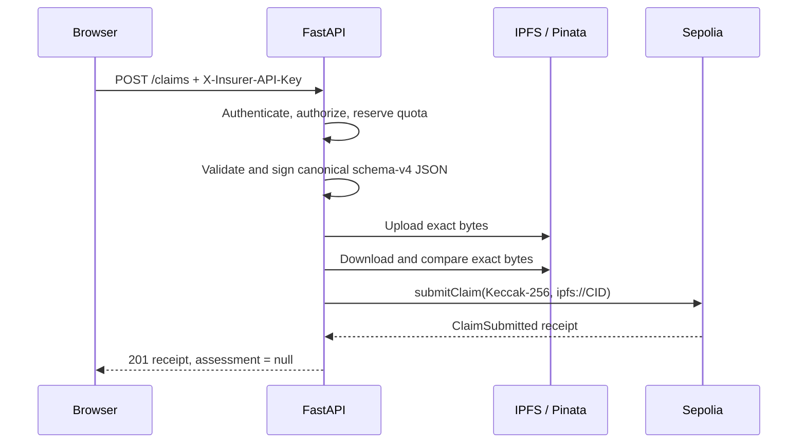
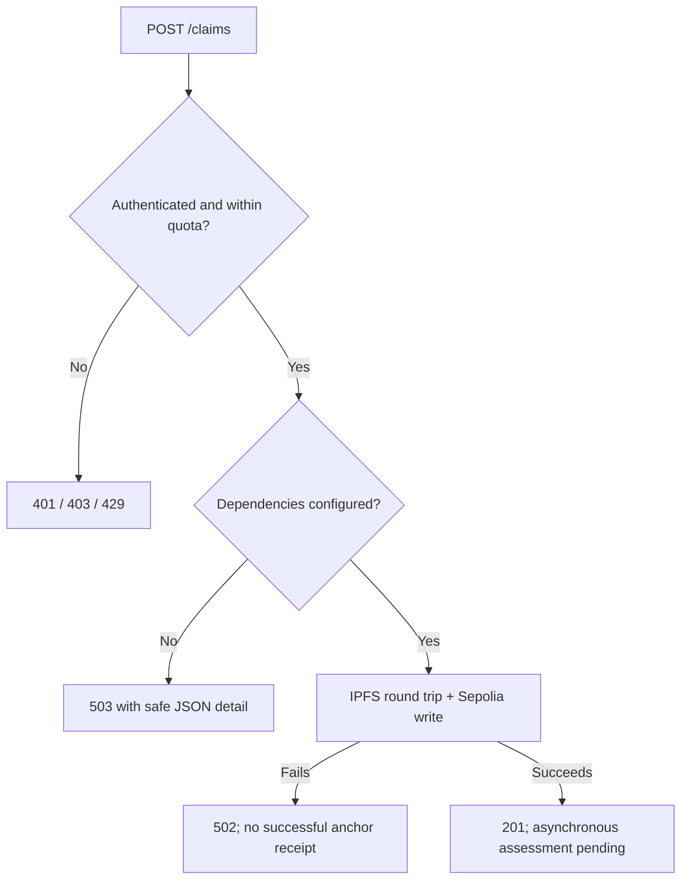

# FastAPI backend

The backend is the trusted entry point for a synthetic claim. It authenticates
the insurer, creates one deterministic document, verifies its public IPFS copy,
and then anchors the document hash and CID on Sepolia.

> Claim content is public and unencrypted on IPFS. Use fictional test data only.

## Submission flow



The API stops at the permanent anchor. The listener and Kafka worker own
duplicate screening, feature persistence, XGBoost/SHAP, and assessment
write-back. The browser polls the assessment endpoint for that later result.

## Code map

| File | Responsibility |
| --- | --- |
| `app/main.py` | Routes, dependencies, CORS, liveness and error translation |
| `app/models.py` | Strict request, IPFS document and response shapes |
| `app/submission_auth.py` | Digest-based credentials, quotas, request size and HMAC attestation |
| `app/service.py` | IPFS round trip followed by Sepolia anchoring |
| `app/blockchain.py` | Role checks, nonce allocation, receipts and public reads |
| `app/health.py` | Dependency-safe readiness reporting |

The query service is deliberately read-only: loading the dashboard does not
construct a wallet or Pinata upload client.

## Endpoints

| Method | Path | Result |
| --- | --- | --- |
| `GET` | `/health` | Compatibility alias for liveness |
| `GET` | `/health/live` | Confirms that the process can answer HTTP |
| `GET` | `/health/ready` | Checks auth config, migrations, IPFS signing config and Sepolia access |
| `GET` | `/claims?page=1&page_size=10` | Current contract state, newest first; maximum page size 50 |
| `GET` | `/claims/{claim_id}/assessment` | Stored model and duplicate result, or `404` while pending |
| `POST` | `/claims` | Authenticate, validate, upload, verify and anchor a claim |

`assessment: null` in a successful `201` response is expected. It means the
claim is safely anchored and asynchronous screening has not completed yet.

## Run locally

From the repository root:

```bash
python3 -m venv apps/backend/.venv
source apps/backend/.venv/bin/activate
python -m pip install --require-hashes -r requirements-dev.lock

cp .env.example .env.local
set -a
source .env.local
set +a

uvicorn apps.backend.app.main:app --reload --host 127.0.0.1 --port 8000
```

Useful URLs:

- Liveness: <http://127.0.0.1:8000/health/live>
- Readiness: <http://127.0.0.1:8000/health/ready>
- OpenAPI UI: <http://127.0.0.1:8000/docs>

## Configuration boundaries

| Setting | Used by | Meaning |
| --- | --- | --- |
| `INSURER_CREDENTIALS_JSON` | API | Credential IDs, insurer IDs, SHA-256 digests, quotas and optional test exemptions; never raw keys |
| `CLAIM_AUTHORIZATION_KEY` | API + worker | Signs the canonical claim so the worker can trust its insurer identity |
| `SEPOLIA_SUBMITTER_PRIVATE_KEY` | API | Sepolia-only wallet with `SUBMITTER_ROLE` |
| `PINATA_JWT` | API | Server-side public upload credential |
| `DATABASE_URL` | API reads | Assessment and duplicate result shown to the browser |
| `FRONTEND_ORIGINS` | API | Allowed browser origins |
| `MAX_CLAIM_BODY_BYTES` | API | Request limit; default 16 KiB |
| `INSURER_RATE_LIMIT_PER_MINUTE` | API | Per-insurer submission limit; default 5 |
| `IP_RATE_LIMIT_PER_MINUTE` | API | Per-IP authentication-attempt limit; default 20 |
| `ALLOW_RATE_LIMIT_BYPASS` | API | Master switch for explicitly exempt performance-test credentials; default `false` |

The deployer key, assessor key, duplicate-fingerprint key, and raw insurer keys
do not belong in the API container. Never put any secret in a `VITE_` variable.

### Local insurer credentials

The example configuration stores only the SHA-256 digests of these intentionally
public local keys:

| Fictional insurer | Local key |
| --- | --- |
| `northstar-mutual` | `local-northstar-mutual-api-key-change-me` |
| `harbour-shield` | `local-harbour-shield-api-key-change-me` |
| `cedar-insurance` | `local-cedar-insurance-api-key-change-me` |
| `performance-test-insurer` (API only) | `local-performance-test-insurer-api-key-change-me` |

For a hosted research run, generate a random key and its digest-only record:

```bash
python apps/backend/scripts/generate_insurer_credential.py \
  northstar-mutual northstar-cloud-v1 --daily-quota 25
```

The raw key is shown once for the fictional insurer operator. Put only the
printed JSON record in `INSURER_CREDENTIALS_JSON`. The built-in quotas are
process-local, reset on restart, and assume one FastAPI process.

### Authorised performance-test bypass

The normal claim form has no control that disables submission limits. For an
isolated local performance test, `.env.example` includes a dedicated API-only
credential for `performance-test-insurer`. Its digest-only record contains the
explicit exemption:

```json
{
  "credentialId": "performance-test-v1",
  "insurerId": "performance-test-insurer",
  "apiKeySha256": "a046fd6eea194db30bba3f5deb7a6d9fc5b7b7f62ac6009f539052509bae3036",
  "dailyQuota": 25,
  "rateLimitExempt": true
}
```

The corresponding public local key is
`local-performance-test-insurer-api-key-change-me`. Generate a new random
dedicated credential instead of using this example key for any hosted test.

The exemption activates only when the API also starts with
`ALLOW_RATE_LIMIT_BYPASS="true"`. Both controls are required deliberately: an
exempt credential behaves like a normal limited credential while the master
switch is false. Normal credentials remain limited when the switch is true, and
invalid or unauthorised attempts continue to count against the IP boundary.

Every successful bypass emits a structured `submission.rate_limit_bypassed`
audit event without logging the raw key or digest. The bypass skips only the
process-local IP, per-minute and daily counters; authentication, insurer
matching, request validation, IPFS verification and blockchain role checks
still apply. Disable the switch immediately after testing. Prefer a local chain
and mock IPFS for load tests because Sepolia transactions and public IPFS still
consume shared resources.

See the dedicated
[rate-limiting and authorised test-bypass runbook](../../docs/rate-limiting-and-authorised-test-bypass.md)
for the counter algorithm, activation matrix, operator procedure, audit fields,
HTTP outcomes, verification commands, and cleanup steps.

## Example request

```bash
curl http://127.0.0.1:8000/claims \
  -H 'Content-Type: application/json' \
  -H 'X-Insurer-API-Key: local-northstar-mutual-api-key-change-me' \
  -d '{
    "insurerId": "northstar-mutual",
    "claimReference": "synthetic-api-1",
    "policyReference": "synthetic-policy-42",
    "claimType": "collision",
    "incidentDate": "2026-07-13",
    "claimAmountUsd": 2500,
    "policyPremiumUsd": 480,
    "vehicleAge": 6,
    "vehicleType": "sedan",
    "country": "Nigeria",
    "regionType": "urban",
    "thirdPartyInjuryFlag": false,
    "totalLossFlag": false,
    "description": "Synthetic bumper damage for API testing",
    "evidence": []
  }'
```

## Failure behaviour



Readiness logs the dependency and exception type while public responses omit
connection strings, credentials, and upstream response bodies.

## Test

```bash
source apps/backend/.venv/bin/activate
python -m pytest apps/backend/tests -q
ruff check apps/backend packages/duplicates packages/integrations
```

The isolated tests use in-memory adapters; they do not spend test ETH, upload to
Pinata, or require PostgreSQL.

## Known limits

- Public IPFS cannot protect real claim data.
- Direct contract pagination fits this prototype, not a large registry.
- API keys and process-local quotas are not enterprise identity or distributed
  abuse prevention.
- Process-level testnet wallets should be replaced by managed signing for a
  production design.

See the [root runbook](../../README.md) and the
[Kafka worker guide](../../packages/integrations/kafka/README.md).
