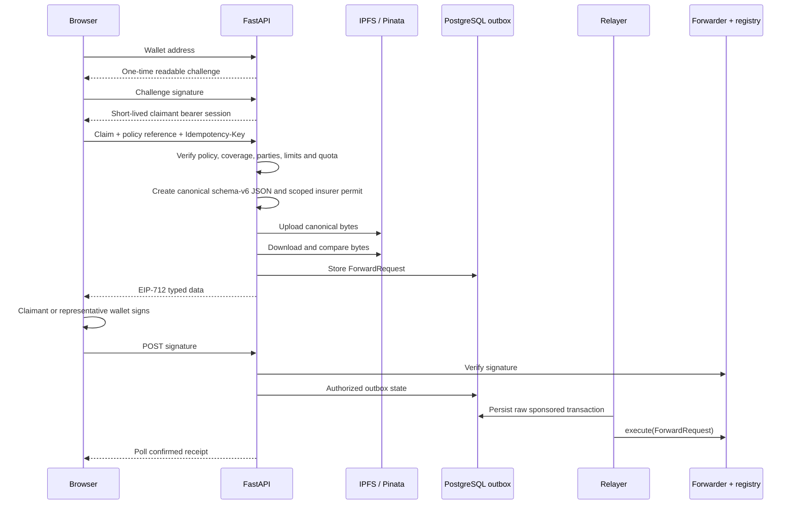
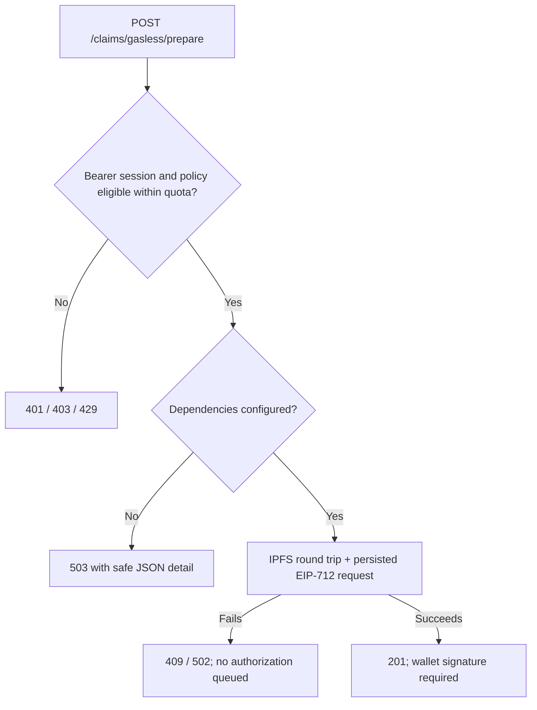

# FastAPI backend

The backend is transaction-keyless: it never holds a claimant or gas-paying
relayer key. It verifies a claimant wallet session and policy, creates one
canonical IPFS document, signs a narrowly scoped insurer permit, and returns an
EIP-712 request for the wallet to sign. A separate relayer sponsors only
wallet-authorized requests from the PostgreSQL outbox.

> Claim content is public and unencrypted on IPFS. Use fictional test data only.

## Quick mental model

Think of FastAPI as the **preparation and policy gate**, not as the blockchain
writer. It answers: “Is this wallet allowed to submit this fictional
claim, and can every later process verify what was authorized?”

| Boundary | Backend responsibility |
| --- | --- |
| Receives | Claimant wallet proof, policy reference, synthetic claim fields and an idempotency key |
| Verifies | Request size/schema, claimant session, policy parties and limits, quota, deployment and signatures |
| Produces | Canonical schema-v6 bytes, public CID, insurer permit, forward request and persisted outbox state |
| Owns | Claimant-session keys, policy lookup keys, insurer-scoped permit key files and the Pinata upload token |
| Must not own | Claimant key, relayer gas key, assessor key, deployer key, model artifact or Kafka consumer loop |

This separation is why a browser retry can safely ask the API for existing
state without accidentally paying gas twice.

## Submission flow



The API stops after recording the authorization; the isolated relayer creates
the permanent anchor. The listener and Kafka worker own duplicate screening,
feature persistence, XGBoost/SHAP, and assessment write-back.

## Code map

| File | Responsibility |
| --- | --- |
| `app/main.py` | Routes, dependencies, CORS, liveness and error translation |
| `app/models.py` | Strict request, IPFS document and response shapes |
| `app/claimant_auth.py` | One-time wallet challenges and short bearer sessions |
| `app/policy_eligibility.py` | Policy, coverage, party and quota verification seam |
| `app/claim_permits.py` | Owner-only, insurer-scoped EIP-712 permit signer |
| `app/submission_auth.py` | Versioned canonical-document HMAC attestation and request size |
| `app/assessor_outcomes.py` | Independent digest-only human-review authentication |
| `app/gasless_service.py` | Idempotent IPFS, EIP-712, sponsorship and status workflow |
| `app/gasless_blockchain.py` | Keyless preparation plus least-privilege relay adapter |
| `apps/relayer/gasless_relayer.py` | Separate sign/broadcast/confirm worker with persistent state |
| `app/health.py` | Dependency-safe readiness reporting |

The query service reads the deployment-scoped PostgreSQL projection. Loading the
dashboard does not construct a Web3 client, wallet, or Pinata upload client.

## Endpoints

| Method | Path | Result |
| --- | --- | --- |
| `GET` | `/health` | Compatibility alias for liveness |
| `GET` | `/health/live` | Confirms that the process can answer HTTP |
| `GET` | `/health/ready` | Checks auth config, migrations, IPFS signing config and Sepolia access |
| `GET` | `/claims?page=1&page_size=10` | Confirmed indexed state, newest first; maximum page size 50 |
| `GET` | `/claims/{claim_id}/assessment` | Stored model and duplicate result, or `404` while pending |
| `POST` | `/claimant/session/challenge` | Issue a one-time wallet sign-in message |
| `POST` | `/claimant/session` | Exchange the wallet proof for a short bearer session |
| `GET` | `/assessor/session` | Validate a human-review key and return its bound assessor reference |
| `GET` | `/assessor/claims/{claim_id}/outcome` | Latest private human outcome revision, or `404` before review |
| `POST` | `/assessor/claims/{claim_id}/outcome` | Append `ConfirmedFraud`, `Legitimate`, or `Inconclusive` after screening |
| `GET` | `/claims/gasless/config` | Public wallet network preflight from server configuration |
| `POST` | `/claims/gasless/prepare` | Authenticate, upload, and return EIP-712 typed data |
| `POST` | `/claims/gasless/{id}/authorize` | Verify wallet signature and enqueue sponsorship |
| `GET` | `/claims/gasless/{id}` | Read persisted relay/confirmation status for the owning claimant subject |
| `POST` | `/claims` | Disabled with HTTP 410; no custodial fallback |

`201` means a wallet-signable request was prepared, not that it was mined.
Only a `confirmed` polling response contains the anchor receipt;
`assessment: null` then means asynchronous screening has not completed yet.

## Run locally

The complete startup order is documented in the
[local development guide](../../LOCAL_DEVELOPMENT.md). For the backend
alone, run from the repository root after PostgreSQL is healthy and migrations
are current:

```bash
test -f .env.local || cp .env.example .env.local
set -a
source .env.local
set +a

# The API must remain free of transaction-paying and assessor keys even though
# the shared local file contains worker settings for developer convenience.
unset SEPOLIA_DEPLOYER_PRIVATE_KEY
unset SEPOLIA_ASSESSOR_PRIVATE_KEY
unset SEPOLIA_RELAYER_PRIVATE_KEY
unset SEPOLIA_RELAYER_PRIVATE_KEY_FILE

apps/backend/.venv/bin/python -m uvicorn \
  apps.backend.app.main:app \
  --reload \
  --host 127.0.0.1 \
  --port 8000
```

`--reload` is a development convenience: Uvicorn starts a watcher and replaces
the application process when Python files change. It does not reload values in
`.env.local` automatically; stop and restart the command after changing a
wallet-session key, deployment ID, or other environment setting.

Verify the process and its dependencies separately:

```bash
curl --fail --silent http://127.0.0.1:8000/health/live \
  | apps/backend/.venv/bin/python -m json.tool
curl --fail --silent http://127.0.0.1:8000/health/ready \
  | apps/backend/.venv/bin/python -m json.tool
curl --fail --silent http://127.0.0.1:8000/claims/gasless/config \
  | apps/backend/.venv/bin/python -m json.tool
```

Liveness only proves that FastAPI can answer HTTP. Readiness also checks claimant
authentication, policy and permit configuration, current migrations, contract
role scopes, Pinata, claim authorization, and the operations credential.

Useful URLs:

- Liveness: <http://127.0.0.1:8000/health/live>
- Readiness: <http://127.0.0.1:8000/health/ready>
- OpenAPI UI: <http://127.0.0.1:8000/docs>
- Indexer operations API: <http://127.0.0.1:8000/operations/indexer>
- Indexer event search: <http://127.0.0.1:8000/operations/indexer/events>

## Configuration boundaries

| Setting | Used by | Meaning |
| --- | --- | --- |
| `CLAIMANT_SESSION_SIGNING_KEY` | API | Signs short-lived claimant bearer sessions |
| `CLAIMANT_SUBJECT_KEY` | API | Produces a stable, non-wallet outbox owner ID |
| `CLAIMANT_AUTH_FINGERPRINT_KEY` | API | HMACs client identities in the challenge ledger |
| `POLICY_ELIGIBILITY_RECORDS_JSON` | API | Digest-only controlled policy adapter records |
| `POLICY_REFERENCE_LOOKUP_KEY` | API | HMAC key for policy-reference lookup |
| `CLAIMANT_COMMITMENT_KEY` | API | Creates the privacy-preserving on-chain claimant commitment |
| `CLAIM_PERMIT_ISSUERS_JSON` | API | Insurer IDs and absolute owner-only permit key-file paths |
| `CLAIM_AUTHORIZATION_KEY` | API + worker | Signs canonical schema-v6 bytes so the worker can trust verified parties |
| `GASLESS_REQUEST_FINGERPRINT_KEY` | API | HMACs idempotency content and client fingerprints stored in PostgreSQL |
| `PINATA_JWT` | API | Server-side public upload credential |
| `DATABASE_URL` | API + relayer | Persistent idempotency, relay outbox, index, assessments and duplicate results |
| `SEPOLIA_RELAYER_PRIVATE_KEY_FILE` | Relayer only | Dedicated gas-paying account; forbidden from all registry roles |
| `FRONTEND_ORIGINS` | API | Allowed browser origins |
| `MAX_CLAIM_BODY_BYTES` | API | Request limit; default 16 KiB |
| `CLAIMANT_RATE_LIMIT_PER_MINUTE` | API | Per-claimant sponsored submission limit; default 5 |
| `IP_RATE_LIMIT_PER_MINUTE` | API | Per-IP authentication-attempt limit; default 20 |
| `ALLOW_RATE_LIMIT_BYPASS` | API | Master switch for explicitly exempt performance-test credentials; default `false` |
| `PUBLIC_DEMO_READ_ONLY` | API | Explicit dissertation-demo switch; permits anonymous operations/assessor reads only, default `false`; assessor writes remain keyed |
| `PUBLIC_PROTOTYPE_ASSESSOR` | API | Supervised prototype-only switch; permits anonymous, append-only off-chain assessor revisions under the fixed `public-prototype-assessor` identity; default `false` and forbidden for production |
| `INDEXER_OPERATIONS_API_KEY_SHA256` | API | SHA-256 digest of the separate read-only operations credential |
| `INDEXER_STALE_AFTER_SECONDS` | API | Marks a lagging checkpoint stalled after this age; default 120 seconds |
| `ASSESSOR_OUTCOME_CREDENTIALS_JSON` | API | Human assessor references and SHA-256 API-key digests for the private outcome console |
| `CONFIRMATION_BLOCKS` | API + listener | Keeps the displayed safe head consistent with listener confirmation depth |

The deployer, relayer, assessor, and claimant wallet keys do not belong in the
API container. The permit signer is a separate, non-paying role loaded from an
owner-only file; use a managed signer boundary in a hosted deployment. Never put
any secret in a `VITE_` variable. See the
[production gasless runbook](../relayer/README.md#production-gasless-claim-transactions) for
deployment, limits, replacements, monitoring, compromise, and rollback.

### Indexer operations authentication

The dedicated `/operations/indexer` and `/operations/indexer/events` endpoints
require `X-Operations-API-Key`. The first returns bounded deployment telemetry;
the second provides filtered keyset pagination over immutable events without an
RPC request. Neither exposes a repair, reset, replay, or mutation action.
Generate a hosted credential with:

```bash
apps/backend/.venv/bin/python \
  apps/backend/scripts/generate_operations_credential.py
```

Give the raw value to trusted operators and store only the printed
`INDEXER_OPERATIONS_API_KEY_SHA256` value in API configuration. The browser keeps
the raw key in `sessionStorage`, which clears when that browser tab is closed;
it is never bundled into frontend JavaScript or sent in a URL. Put the route
behind an enterprise identity-aware proxy when one is available.

### Human assessor outcome authentication

The `/assessor` browser surface uses `X-Assessor-API-Key`. It does not accept an
insurer key, operations key, Ethereum wallet, or the scoring worker's private
key. Generate each reviewer credential independently:

```bash
apps/backend/.venv/bin/python \
  apps/backend/scripts/generate_assessor_outcome_credential.py \
  research-assessor-1
```

Give the raw key only to that reviewer and append only the printed digest-bearing
JSON record to `ASSESSOR_OUTCOME_CREDENTIALS_JSON`. The assessor reference comes
from this server-side binding, never from a request body. The browser retains the
raw key only in its tab's `sessionStorage`.

Recording a human outcome creates an append-only PostgreSQL revision. It neither
updates Sepolia nor maps claim `Approved`/`Rejected` status to fraud. A later
governed dataset process may consider `ConfirmedFraud` and `Legitimate` records;
`Inconclusive` is explicitly ineligible for a binary label. No endpoint in this
module trains, approves, or deploys a model.

### Legacy insurer credentials

`SubmissionBoundary` remains available only to verify and migrate existing
schema-v5 documents. Public HTTP submission routes do not load or accept insurer
API keys, and the React form no longer contains a credential field. The legacy
local fixture was:

| Fictional insurer | Local key |
| --- | --- |
| `northstar-mutual` | `local-northstar-mutual-api-key-change-me` |

Do not provision new public claimants through this mechanism. New intake uses a
wallet session plus `POLICY_ELIGIBILITY_RECORDS_JSON`; insurer authority comes
from the scoped permit key, not a browser-supplied organization secret.

For a hosted research run, generate a random key and its digest-only record:

```bash
apps/backend/.venv/bin/python \
  apps/backend/scripts/generate_insurer_credential.py \
  northstar-mutual northstar-cloud-v1 0xYOUR_INSURER_WALLET \
  --daily-quota 25
```

The raw key is shown once for the fictional insurer operator. Put only the
printed JSON record in `INSURER_CREDENTIALS_JSON`. Valid sponsorship quotas are
rechecked durably under PostgreSQL locks; the earlier invalid-credential abuse
counter remains process-local and should also be enforced at a production edge.

### Legacy performance-test bypass

This compatibility mechanism applies only to legacy insurer principals. Public
claimants always use the PostgreSQL-backed limits from their verified policy;
neither the browser nor a bearer token can request an exemption. For historical
schema-v5 test tooling, the old record shape was:

```json
{
  "credentialId": "performance-test-v1",
  "insurerId": "performance-test-insurer",
  "apiKeySha256": "a046fd6eea194db30bba3f5deb7a6d9fc5b7b7f62ac6009f539052509bae3036",
  "dailyQuota": 25,
  "rateLimitExempt": true
}
```

The corresponding public local key is
`local-performance-test-insurer-api-key-change-me`. Generate a new random
dedicated credential instead of using this example key for any hosted test.

The exemption activates only when the API also starts with
`ALLOW_RATE_LIMIT_BYPASS="true"`. Requiring both controls means an exempt
credential behaves like a normal limited credential while the master
switch is false. Normal credentials remain limited when the switch is true, and
invalid or unauthorised attempts continue to count against the IP boundary.

Every successful bypass emits a structured `submission.rate_limit_bypassed`
audit event without logging the raw key or digest. The bypass skips only the
process-local IP, per-minute and daily counters; authentication, insurer
matching, request validation, IPFS verification and blockchain role checks
still apply. Disable the switch immediately after testing. Prefer a local chain
and mock IPFS for load tests because Sepolia transactions and public IPFS still
consume shared resources.

See the dedicated
[rate-limiting and authorised test-bypass runbook](README.md#public-claim-intake-limits)
for the counter algorithm, activation matrix, operator procedure, audit fields,
HTTP outcomes, verification commands, and cleanup steps.

## Trying the API

Start with the public preflight endpoint:

```bash
curl --fail --silent http://127.0.0.1:8000/claims/gasless/config \
  | apps/backend/.venv/bin/python -m json.tool
```

The normal end-to-end client is the React form because preparation requires two
wallet proofs and an EIP-712 signature.
Swagger can inspect the request/response schemas, but it cannot safely replace
the wallet-signing step. Open <http://127.0.0.1:5173>, connect the configured
test wallet, and follow the browser progress states.

`POST /claims` is disabled and returns HTTP 410. There is no
server-custodial fallback that silently uses a backend submitter key.

## Failure behaviour



Readiness logs the dependency and exception type while public responses omit
connection strings, credentials, and upstream response bodies.

## Test

```bash
apps/backend/.venv/bin/python -m pytest apps/backend/tests -q
apps/backend/.venv/bin/python -m ruff check \
  apps/backend packages/duplicates packages/integrations
```

The isolated tests use in-memory adapters; they do not spend test ETH, upload to
Pinata, or require PostgreSQL.

## Known limits

- Public IPFS cannot protect real claim data.
- Claims pagination is served by the confirmed PostgreSQL event projection and
  can lag Sepolia by the configured confirmation depth.
- Wallet proof is not policy eligibility by itself; the policy adapter must use
  an insurer-controlled source before real-world use. Sponsorship quotas are
  stored in PostgreSQL.
- The relayer key should use a secret-manager file mount or managed signer and a
  capped balance. It never belongs in the API process.

See the [root runbook](../../README.md) and the
[Kafka worker guide](../../packages/integrations/kafka/README.md).

---

## Public claim intake limits

The API stores abuse-control state for wallet authentication and sponsored
claim preparation in PostgreSQL. Transactions keep those limits consistent
across API replicas and restarts.

> Use fictional claim data in this repository. Preparing a claim uploads the
> canonical document to public IPFS, and authorizing it can spend Sepolia ETH
> from the relayer account.

### Boundaries

| Boundary | Stored key | Default | Configuration |
| --- | --- | ---: | --- |
| Challenge requests by client | HMAC client fingerprint | 20/minute | `CLAIMANT_AUTH_CLIENT_RATE_PER_MINUTE` |
| Challenge requests by wallet | Wallet address | 5/minute | `CLAIMANT_AUTH_WALLET_RATE_PER_MINUTE` |
| Sponsored preparations by claimant | HMAC wallet subject | 5/minute | `CLAIMANT_RATE_LIMIT_PER_MINUTE` |
| Sponsored preparations by client | HMAC client fingerprint | 20/minute | `IP_RATE_LIMIT_PER_MINUTE` |
| Sponsored preparations by policy | HMAC wallet subject + UTC day | Policy-specific | `dailyQuota` in `POLICY_ELIGIBILITY_RECORDS_JSON` |
| Concurrent sponsored work | HMAC wallet subject | One active submission | Fixed state-machine invariant |

The API returns `429 Too Many Requests` with a positive `Retry-After` header
when a configurable limit is exhausted. A second active submission returns a
conflict until the existing workflow reaches a terminal state or its unsigned
preparation lease expires.

### Authentication challenges

`POST /claimant/session/challenge` stores the readable message the wallet
will sign. Before inserting it, the repository serializes the relevant client
and wallet decisions, counts challenges issued in the previous minute, and
rejects requests that exceed either limit.

Client identifiers are stored as domain-separated HMAC fingerprints. Raw IP
addresses are never written to the challenge table. Wallet addresses are kept
because signature verification must bind the recovered signer to the original
request. A challenge is valid once, expires after
`CLAIMANT_CHALLENGE_TTL_SECONDS`, and is atomically consumed when a session is
created. Expired records are retained briefly as audit and rate-limit evidence,
then removed opportunistically.

### Sponsored submissions

`POST /claims/gasless/prepare` authenticates the short-lived claimant bearer
session, verifies policy eligibility, then asks PostgreSQL to reserve
sponsorship before any paid IPFS or chain work occurs. Advisory locks make the
following decisions atomic across replicas:

- idempotency-key reuse is allowed only for the same canonical claim;
- one claimant cannot hold multiple active forwarder requests;
- per-minute claimant and client limits cannot be over-issued; and
- the policy's UTC daily sponsorship quota cannot be over-issued.

The bearer token is never stored. Submission ownership uses a stable,
environment-specific HMAC subject derived from the authenticated wallet. The
client address is also HMAC-fingerprinted before persistence.

### Controlled performance-test bypass

`ALLOW_RATE_LIMIT_BYPASS` defaults to `false` and must remain disabled in normal
environments. The bypass affects sponsored preparation limits only; it never
skips wallet authentication, policy eligibility, idempotency, one-active-claim
protection, IPFS verification, contract roles, signatures, receipt validation,
or downstream processing.

Public policy records are not exempt by configuration, so enabling the master
switch alone does nothing for claimant traffic. A test-only caller must be
constructed explicitly with `rate_limit_exempt=True` inside an isolated test
harness. Do not add a browser flag, query parameter, API route, or policy JSON
field that can activate this behavior.

For routine load tests, replace IPFS, RPC, and relayer adapters with the
repository's in-memory/test doubles. Use the live Sepolia path only for a small,
funded end-to-end verification.

### Operational checks

Before enabling public submission, confirm:

1. PostgreSQL migrations `007` and `008` are applied.
2. All HMAC/session keys contain independent, high-entropy production values.
3. The policy eligibility source contains the expected claimant and delegate
   wallets and the intended `dailyQuota`.
4. Edge infrastructure also limits request bodies, connections, and obviously
   abusive unauthenticated traffic.
5. Metrics alert on sustained HTTP 429 responses, active-preparation conflicts,
   relay failures, and relayer balance.

The application-level controls protect business invariants. They complement,
but do not replace, distributed edge throttling and denial-of-service controls.

### Test coverage

The relevant suites are:

- `apps/backend/tests/test_claimant_auth.py` for one-time challenges, signature
  recovery, token expiry, and challenge limits;
- `apps/backend/tests/test_policy_eligibility.py` for claimant/delegate,
  coverage, incident, amount, and quota policy;
- `apps/backend/tests/test_gasless_service.py` for public preparation and
  restart and retry behavior; and
- `packages/integrations/postgres/tests/test_migrations.py` for the persistence
  schema and constraints.
