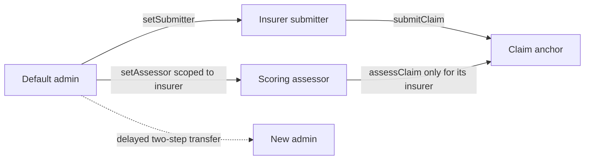
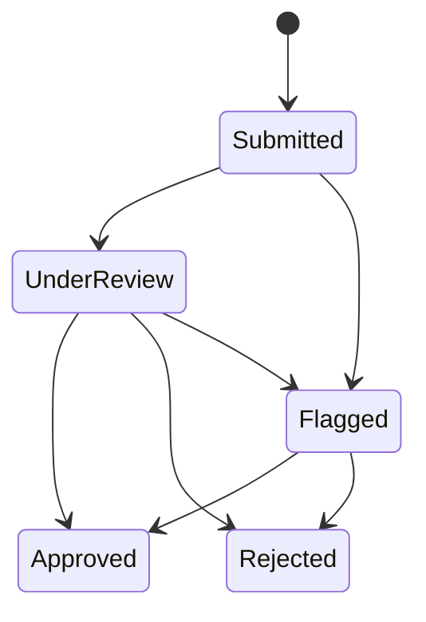

# Claims registry smart contract

`ClaimsRegistry.sol` keeps a compact public lifecycle record: a claim hash, an
`ipfs://` pointer, status, score, and timestamps. The full claim stays off-chain.

`Counter.sol`, `Counter.ts`, and `send-op-tx.ts` are retained Hardhat examples;
they are not selected by the claims application.

## Roles



Admin, submitter, and assessor must be different addresses. Scoped roles can be
changed only through `setSubmitter` and `setAssessor`; generic role calls are
blocked so they cannot bypass separation and assessor-scope checks.

## Claim lifecycle



- The first assessment fixes a score between `0` and `10,000`.
- Later lifecycle updates must carry the same score.
- `Approved` and `Rejected` are final.
- An assessor can update only claims created by its configured insurer.

## Public interface

| Function | Meaning |
| --- | --- |
| `submitClaim(hash, pointer)` | Create a `Submitted` claim from an authorized submitter |
| `getClaim(id)` | Read one compact claim record |
| `verifyClaimData(id, bytes)` | Compare supplied bytes with the saved Keccak-256 hash |
| `assessClaim(id, status, score)` | Apply an allowed transition from the scoped assessor |
| `isSubmitter` / `isAssessor` | Preflight a service wallet's role |
| `assessorInsurer` | Read an assessor's submitter scope |
| `setSubmitter` / `setAssessor` | Administer scoped service roles |

Pointers must be a bare alphanumeric `ipfs://CID` no longer than 128 bytes.
Paths, query strings, and other schemes are rejected before they become
permanent events.

## Install and verify

From the repository root:

```bash
npm --prefix apps/contracts ci
npm --prefix apps/contracts exec -- hardhat compile
npm --prefix apps/contracts exec -- hardhat test
npm --prefix apps/contracts exec -- hardhat build --build-profile production
```

Run one test family from `apps/contracts/` when iterating:

```bash
npx hardhat test solidity
npx hardhat test nodejs
```

The Solidity suite targets invariants and lifecycle rules. The TypeScript suite
uses Viem for deployment and integration behaviour.

## Local deployment

Terminal A:

```bash
cd apps/contracts
npx hardhat node
```

Terminal B:

```bash
cd apps/contracts
cp ignition/parameters/sepolia.json.example /tmp/claims-local.json
# Replace the three placeholders with different local Hardhat accounts.
npx hardhat ignition deploy ignition/modules/Claimsregistry.ts \
  --parameters /tmp/claims-local.json \
  --network localhost
```

Ignition writes the result under `ignition/deployments/chain-31337/`.

## Sepolia deployment

Hardhat reads the RPC URL and deployer key from its keystore:

```bash
cd apps/contracts
npx hardhat keystore set SEPOLIA_RPC_URL
npx hardhat keystore set SEPOLIA_DEPLOYER_PRIVATE_KEY

cp ignition/parameters/sepolia.json.example ignition/parameters/sepolia.json
# Replace every address; admin, submitter and assessor must be distinct.
npx hardhat ignition deploy ignition/modules/Claimsregistry.ts \
  --parameters ignition/parameters/sepolia.json \
  --network sepolia
```

The deployer/admin key is not an application runtime secret. The API receives
only a submitter key and the scoring worker receives only an assessor key.

## Checked-in hardened deployment

| Item | Value |
| --- | --- |
| Chain | Sepolia (`11155111`) |
| Deployment ID | `sepolia-security-audit-v1` |
| Module | `ClaimsRegistryModule#ClaimsRegistry` |
| Address | `0x2AbAbD3553d5963A4844328B7b42DbC5795B78cB` |
| Admin transfer delay | 86,400 seconds |
| Explorer | [Open in Etherscan](https://sepolia.etherscan.io/address/0x2AbAbD3553d5963A4844328B7b42DbC5795B78cB) |

The older address `0x57E3203b9427BE41c753bEedD526D81a66bFc2AB`
is a legacy research record. It lacks the hardened role, transition, pointer,
and administration rules and must not be selected by current runtimes.

## Security boundary

OpenZeppelin supplies the access-control primitives, but the complete custom
contract has not received an independent professional audit. The pointer is
public, the contract cannot encrypt or delete IPFS content, role wallets still
need operational protection, and Sepolia provides testnet—not production—
assurance.

See [SECURITY_AUDIT.md](SECURITY_AUDIT.md) for implemented findings and remaining
risks, and the [root runbook](../../README.md) for runtime artifact selection.
