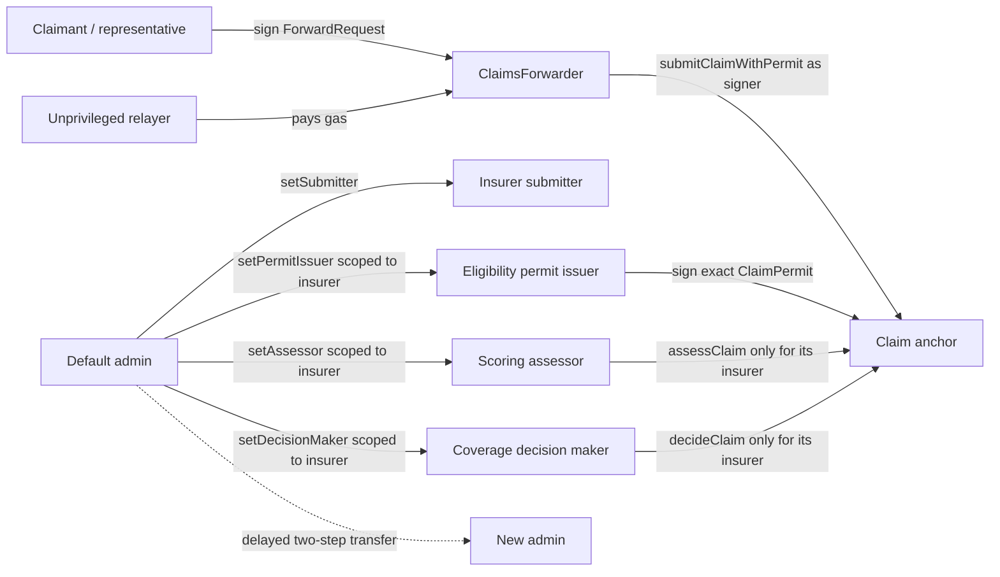
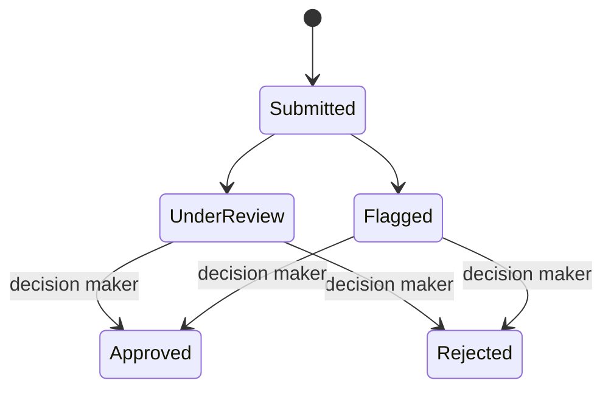

# Claims registry smart contract

`ClaimsRegistry.sol` keeps a compact public lifecycle record: a claim hash, an
`ipfs://` pointer, status, score, and timestamps. `ClaimsForwarder.sol` is the
immutable EIP-712/ERC-2771 verification boundary used for sponsored calls.

`Counter.sol`, `Counter.ts`, and `send-op-tx.ts` are retained Hardhat examples;
they are not selected by the claims application.

## Roles



Admin, submitter, permit issuer, scoring assessor, and coverage decision maker
must be different addresses. Scoped roles can be changed only through
`setSubmitter`, `setPermitIssuer`, `setAssessor`, and `setDecisionMaker`;
generic role calls are blocked so they cannot bypass separation or
insurer-scope checks.

## Claim lifecycle



- The one permitted scoring assessment fixes a score between `0` and `10,000`
  and moves only from `Submitted` to `UnderReview` or `Flagged`.
- A scoring assessor cannot approve or reject a claim.
- A separate insurer-scoped decision maker can move a screened claim to
  `Approved` or `Rejected`, recording a non-zero hash of the off-chain decision
  proposal.
- `Approved` and `Rejected` are final.
- An assessor can update only claims created by an insurer in its explicit
  many-to-many scope. Removing one scope does not revoke its other scopes.

## Public interface

| Function | Meaning |
| --- | --- |
| `submitClaim(hash, pointer)` | Create a `Submitted` claim from an authorized submitter |
| `submitClaimWithPermit(permit, pointer, signature)` | Create a public claim from a wallet signer plus one-time insurer permit |
| `getClaim(id)` | Read one compact claim record |
| `getClaimParties(id)` | Read insurer, actual submitter and claimant commitment |
| `claimPermitDigest(permit)` | Return the canonical EIP-712 permit digest |
| `isClaimPermitUsed(id)` | Check one-time permit consumption |
| `verifyClaimData(id, bytes)` | Compare supplied bytes with the saved Keccak-256 hash |
| `assessClaim(id, status, score)` | Record the one model-screening transition from the scoped assessor |
| `decideClaim(id, status, decisionHash)` | Finalize an already screened claim from the scoped decision maker |
| `getClaimDecision(id)` | Read the decision hash, maker and timestamp for a finalized claim |
| `isSubmitter` / `isAssessor` / `isDecisionMaker` | Preflight a service wallet's role |
| `isAssessorFor` | Read one assessor/insurer scope |
| `isDecisionMakerFor` | Read one decision-maker/insurer scope |
| `isPermitIssuerFor` | Read one permit-issuer/insurer scope |
| `trustedForwarder` | Read the immutable ERC-2771 forwarder |
| `setSubmitter` / `setPermitIssuer` / `setAssessor` / `setDecisionMaker` | Administer scoped service roles |

Pointers must be a bare alphanumeric `ipfs://CID` no longer than 128 bytes.
Paths, query strings, and other schemes are rejected before they become
permanent events.

## Install and verify

From the repository root:

```bash
npm --prefix apps/contracts ci
cd apps/contracts
npm exec -- hardhat compile
npm exec -- hardhat test
npm exec -- hardhat build --build-profile production
```

Run one test family from the same `apps/contracts/` directory when iterating:

```bash
npm exec -- hardhat test solidity
npm exec -- hardhat test nodejs
```

The Solidity suite targets invariants and lifecycle rules. The TypeScript suite
uses Viem for deployment and integration behaviour.

## Local deployment

Terminal A:

```bash
cd apps/contracts
npm exec -- hardhat node
```

Terminal B:

```bash
cd apps/contracts
cp ignition/parameters/sepolia.json.example /tmp/claims-local.json
# Replace the five role placeholders with different local Hardhat accounts.
npm exec -- hardhat ignition deploy ignition/modules/Claimsregistry.ts \
  --parameters /tmp/claims-local.json \
  --network localhost
```

Ignition writes the result under `ignition/deployments/chain-31337/`.

## Sepolia deployment

Hardhat reads the RPC URL and deployer key from its keystore:

```bash
cd apps/contracts
npm exec -- hardhat keystore set SEPOLIA_RPC_URL
npm exec -- hardhat keystore set SEPOLIA_DEPLOYER_PRIVATE_KEY

cp ignition/parameters/sepolia.json.example ignition/parameters/sepolia.json
# Replace every address; all five role addresses must be distinct.
npm exec -- hardhat ignition deploy ignition/modules/Claimsregistry.ts \
  --parameters ignition/parameters/sepolia.json \
  --network sepolia
```

The deployer/admin key is not an application runtime secret. The eligibility
service receives only an insurer-scoped, non-paying permit key, the scoring
worker receives only an assessor key, and the relayer receives an unprivileged
gas-paying key. The browser governance console uses a separate scoped decision
wallet. FastAPI never receives claimant or transaction-paying keys.

## Sepolia deployment artifacts

The currently checked-in public-intake deployment predates governed coverage
decisions. It remains readable and supports existing intake, but the governance
API deliberately rejects it. Deploy this branch first and save its Ignition
artifacts under a new deployment ID before enabling `/governance`.

The previous gasless research deployment is:

| Item | Value |
| --- | --- |
| Chain | Sepolia (`11155111`) |
| Deployment ID | `sepolia-gasless-v1` |
| Registry | `0x5A7A3e22843397f998823D0d58aBd2E1f4b2A300` |
| Forwarder | `0x0e68Ac27a344f454373604Eec3144c427661E5F0` |
| Registry deployment block | `11426492` |
| Initial submitter | `0xCa07685b14F806c1E7AD4541330B4Ad24F6581Bd` |

The initial submitter is a public address, not a bundled private key. A local
browser submission must connect that test wallet or another signer later
authorized by the admin. The relayer must be a different funded address with no
registry role.

The earlier hardened but non-gasless deployment remains available as read-only
history:

| Item | Value |
| --- | --- |
| Chain | Sepolia (`11155111`) |
| Deployment ID | `sepolia-security-audit-v1` |
| Module | `ClaimsRegistryModule#ClaimsRegistry` |
| Address | `0x2AbAbD3553d5963A4844328B7b42DbC5795B78cB` |
| Admin transfer delay | 86,400 seconds |
| Explorer | [Open in Etherscan](https://sepolia.etherscan.io/address/0x2AbAbD3553d5963A4844328B7b42DbC5795B78cB) |

This deployment predates `ClaimsForwarder`; gasless writers fail closed if it is
selected. The older address
`0x57E3203b9427BE41c753bEedD526D81a66bFc2AB`
is a legacy research record. It lacks the hardened role, transition, pointer,
and administration rules and must not be selected by current runtimes.

## Security boundary

OpenZeppelin supplies the access-control primitives, but the complete custom
contract has not received an independent professional audit. The pointer and
encrypted bytes are public, the contract cannot delete IPFS content or protect
off-chain wrapping keys, role wallets still need operational protection, and
Sepolia provides testnet—not production—assurance.

See the [security review](#solidity-security-review) for implemented findings and remaining
risks, the [production gasless runbook](../relayer/README.md#production-gasless-claim-transactions),
and the [root runbook](../../README.md) for runtime artifact selection.

---

## Solidity security review

Date: 29 July 2026

Branch: `security/solidity-contract-audit`

This is an internal engineering review of the dissertation prototype, not a
professional third-party audit or a guarantee of security.

> Gasless ERC-2771 changes were implemented later and are outside this dated
> review. They require a new independent review and deployment; see the
> [production gasless runbook](../relayer/README.md#production-gasless-claim-transactions).

### Scope

- `contracts/ClaimsRegistry.sol`
- Hardhat Ignition deployment and role parameters
- Backend and worker signing-key boundaries
- Listener handling of immutable invalid claim events

### Implemented remediations

| Finding | Remediation |
| --- | --- |
| Permissionless submissions could feed invalid pointers into the listener | `submitClaim` now requires `SUBMITTER_ROLE`, accepts only a bounded bare `ipfs://CID`, and the listener quarantines permanent invalid events |
| Administration, submission and assessment reused one wallet | The contract enforces distinct admin, submitter and assessor addresses; application processes load separate environment keys |
| Any assessor could modify any insurer's claim | Every assessor is explicitly scoped to authorized insurer wallets |
| Status and score could be rewritten arbitrarily | The lifecycle is forward-only and the initial model score cannot change during later transitions |
| Ownership transfer was immediate and one-step | OpenZeppelin `AccessControlDefaultAdminRules` adds a configurable delay and explicit acceptance |
| Generic role calls could bypass scoped-role setup | Submitter and assessor roles can only be changed through their invariant-preserving configuration functions |

### Verification

- Solidity and TypeScript contract tests: 30 passed.
- Python backend, listener, IPFS and Kafka tests: 63 passed, 3 integration
  tests skipped because their external services were not enabled.
- Docker Compose configuration validation: passed.
- TypeScript type-check: passed.
- `npm audit --omit=dev`: no production dependency vulnerabilities reported.

The contract tests cover unauthorized submission, malformed pointers,
cross-insurer assessment, invalid status regression, score replacement,
role-reuse attempts, delayed administration transfer, and fraud-score fuzzing.

### Residual risks and limitations

- IPFS pointers and encrypted envelopes remain public. Confidentiality depends
  on the independently operated wrapping-key system and only fictional,
  synthetic research data is permitted in this repository.
- A compromised default administrator can immediately change submitter and
  assessor roles. A production design should use a multisignature account or
  timelock and managed signing infrastructure.
- RPC, IPFS, Kafka and Sepolia remain availability dependencies.
- The contract is not upgradeable. Remediation requires deploying a new
  contract and intentionally migrating application configuration.
- The development toolchain still reports advisories in development-only npm
  packages. These packages are not shipped in the application runtime, but
  should be reviewed during routine dependency upgrades.

### Deployment status

After explicit project-owner authorization, the hardened contract was deployed
to Sepolia as Ignition deployment `sepolia-security-audit-v1` at
`0x2AbAbD3553d5963A4844328B7b42DbC5795B78cB`. Read-only verification confirmed
the deployed bytecode, distinct role accounts, assessor-to-submitter scope,
86,400-second administration-transfer delay, and zero initial claims.

The earlier checked-in address remains the legacy pre-remediation contract and
must not be used to validate these security controls.
