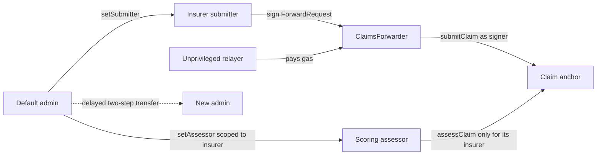
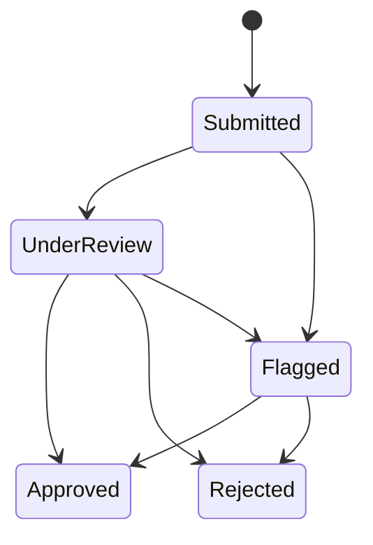

# Claims registry smart contract

`ClaimsRegistry.sol` keeps a compact public lifecycle record: a claim hash, an
`ipfs://` pointer, status, score, and timestamps. `ClaimsForwarder.sol` is the
immutable EIP-712/ERC-2771 verification boundary used for sponsored calls.

`Counter.sol`, `Counter.ts`, and `send-op-tx.ts` are retained Hardhat examples;
they are not selected by the claims application.

## Roles



Admin, submitter, and assessor must be different addresses. Scoped roles can be
changed only through `setSubmitter` and `setAssessor`; generic role calls are
blocked so they cannot bypass separation and assessor-scope checks.

## Claim lifecycle



- The first assessment fixes a score between `0` and `10,000`.
- Later lifecycle updates must carry the same score.
- `Approved` and `Rejected` are final.
- An assessor can update only claims created by an insurer in its explicit
  many-to-many scope. Removing one scope does not revoke its other scopes.

## Public interface

| Function | Meaning |
| --- | --- |
| `submitClaim(hash, pointer)` | Create a `Submitted` claim from an authorized submitter |
| `getClaim(id)` | Read one compact claim record |
| `verifyClaimData(id, bytes)` | Compare supplied bytes with the saved Keccak-256 hash |
| `assessClaim(id, status, score)` | Apply an allowed transition from the scoped assessor |
| `isSubmitter` / `isAssessor` | Preflight a service wallet's role |
| `isAssessorFor` | Read one assessor/insurer scope |
| `trustedForwarder` | Read the immutable ERC-2771 forwarder |
| `setSubmitter` / `setAssessor` | Administer scoped service roles |

Pointers must be a bare alphanumeric `ipfs://CID` no longer than 128 bytes.
Paths, query strings, and other schemes are rejected before they become
permanent events.

## Install and verify

From the repository root:

```bash
npm --prefix apps/contracts ci
cd apps/contracts
npm exec -- hardhat compile
npm exec -- hardhat test
npm exec -- hardhat build --build-profile production
```

Run one test family from the same `apps/contracts/` directory when iterating:

```bash
npm exec -- hardhat test solidity
npm exec -- hardhat test nodejs
```

The Solidity suite targets invariants and lifecycle rules. The TypeScript suite
uses Viem for deployment and integration behaviour.

## Local deployment

Terminal A:

```bash
cd apps/contracts
npm exec -- hardhat node
```

Terminal B:

```bash
cd apps/contracts
cp ignition/parameters/sepolia.json.example /tmp/claims-local.json
# Replace the three placeholders with different local Hardhat accounts.
npm exec -- hardhat ignition deploy ignition/modules/Claimsregistry.ts \
  --parameters /tmp/claims-local.json \
  --network localhost
```

Ignition writes the result under `ignition/deployments/chain-31337/`.

## Sepolia deployment

Hardhat reads the RPC URL and deployer key from its keystore:

```bash
cd apps/contracts
npm exec -- hardhat keystore set SEPOLIA_RPC_URL
npm exec -- hardhat keystore set SEPOLIA_DEPLOYER_PRIVATE_KEY

cp ignition/parameters/sepolia.json.example ignition/parameters/sepolia.json
# Replace every address; admin, submitter and assessor must be distinct.
npm exec -- hardhat ignition deploy ignition/modules/Claimsregistry.ts \
  --parameters ignition/parameters/sepolia.json \
  --network sepolia
```

The deployer/admin key is not an application runtime secret. Each insurer keeps
its submitter wallet, the scoring worker receives only an assessor key, and the
separate relayer receives an unprivileged gas-paying key. FastAPI is keyless.

## Sepolia deployment artifacts

The current gasless research deployment is:

| Item | Value |
| --- | --- |
| Chain | Sepolia (`11155111`) |
| Deployment ID | `sepolia-gasless-v1` |
| Registry | `0x5A7A3e22843397f998823D0d58aBd2E1f4b2A300` |
| Forwarder | `0x0e68Ac27a344f454373604Eec3144c427661E5F0` |
| Registry deployment block | `11426492` |
| Initial submitter | `0xCa07685b14F806c1E7AD4541330B4Ad24F6581Bd` |

The initial submitter is a public address, not a bundled private key. A local
browser submission must connect that test wallet or another signer later
authorized by the admin. The relayer must be a different funded address with no
registry role.

The earlier hardened but non-gasless deployment remains available as read-only
history:

| Item | Value |
| --- | --- |
| Chain | Sepolia (`11155111`) |
| Deployment ID | `sepolia-security-audit-v1` |
| Module | `ClaimsRegistryModule#ClaimsRegistry` |
| Address | `0x2AbAbD3553d5963A4844328B7b42DbC5795B78cB` |
| Admin transfer delay | 86,400 seconds |
| Explorer | [Open in Etherscan](https://sepolia.etherscan.io/address/0x2AbAbD3553d5963A4844328B7b42DbC5795B78cB) |

This deployment predates `ClaimsForwarder`; gasless writers fail closed if it is
selected. The older address
`0x57E3203b9427BE41c753bEedD526D81a66bFc2AB`
is a legacy research record. It lacks the hardened role, transition, pointer,
and administration rules and must not be selected by current runtimes.

## Security boundary

OpenZeppelin supplies the access-control primitives, but the complete custom
contract has not received an independent professional audit. The pointer is
public, the contract cannot encrypt or delete IPFS content, role wallets still
need operational protection, and Sepolia provides testnet—not production—
assurance.

See [SECURITY_AUDIT.md](SECURITY_AUDIT.md) for implemented findings and remaining
risks, the [production gasless runbook](../../docs/production-gasless-transactions.md),
and the [root runbook](../../README.md) for runtime artifact selection.
