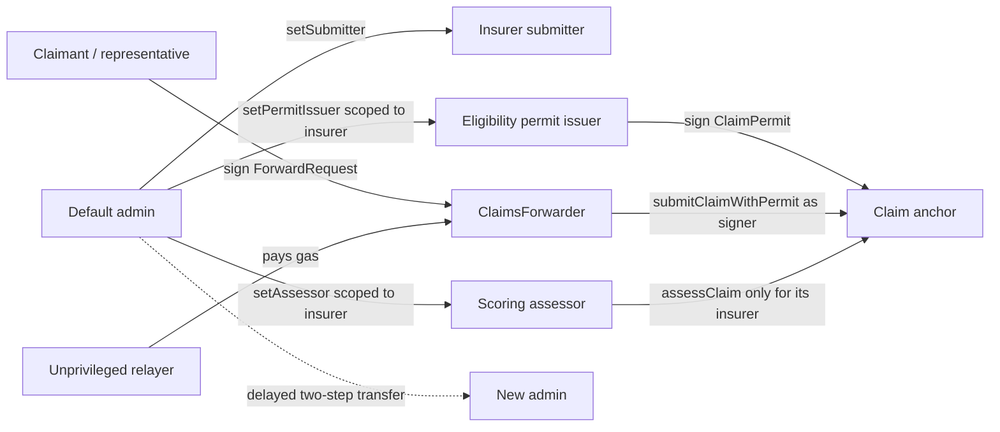
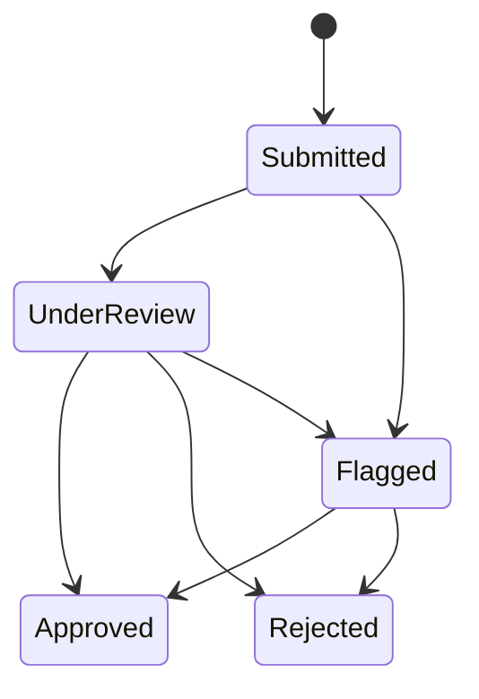

# Claims registry smart contract

`ClaimsRegistry.sol` keeps a compact public lifecycle record: a claim hash, an
`ipfs://` pointer, status, score, and timestamps. `ClaimsForwarder.sol` is the
immutable EIP-712/ERC-2771 verification boundary used for sponsored calls.

`Counter.sol`, `Counter.ts`, and `send-op-tx.ts` are retained Hardhat examples;
they are not selected by the claims application.

## Quick mental model

The contracts are the **small public rulebook**. They do not know the policy
document, fraud explanation, database row, or API session. They know only
enough to prove who authorized an anchor, preserve its integrity, and constrain
later lifecycle changes.

| Boundary | Contract responsibility |
| --- | --- |
| Receives | A claim hash, safe `ipfs://` pointer, party commitments, signatures and later assessment status/score |
| Verifies | Role scope, one-time permit, EIP-712 request, trusted-forwarder sender and allowed state transition |
| Stores | Compact public claim/party records, used permit IDs, status, basis-point score and timestamps |
| Emits | Ordered `ClaimSubmitted` and `ClaimAssessed` evidence for the listener |
| Not stored | Full claim JSON, policy reference, SHAP reasons, human fraud outcome and private keys |

`ClaimsForwarder` answers “who signed this request?”; `ClaimsRegistry` answers
“is that signer, permit, and transition allowed?” Keeping those questions
separate makes sponsored gas payment possible without trusting the relayer.

## Roles



Admin, submitter, permit issuer, and assessor must be different addresses.
Scoped roles can be changed only through `setSubmitter`, `setPermitIssuer`, and
`setAssessor`; generic role calls are blocked so they cannot bypass separation
or insurer-scope checks.

## Claim lifecycle



- The first assessment fixes a score between `0` and `10,000`.
- Later lifecycle updates must carry the same score.
- `Approved` and `Rejected` are final.
- An assessor can update only claims created by an insurer in its explicit
  many-to-many scope. Removing one scope does not revoke its other scopes.

## Public interface

| Function | Meaning |
| --- | --- |
| `submitClaim(hash, pointer)` | Create a `Submitted` claim from an authorized submitter |
| `submitClaimWithPermit(permit, pointer, signature)` | Create a public claim from a wallet signer plus one-time insurer permit |
| `getClaim(id)` | Read one compact claim record |
| `getClaimParties(id)` | Read insurer, actual submitter and claimant commitment |
| `claimPermitDigest(permit)` | Return the canonical EIP-712 permit digest |
| `isClaimPermitUsed(id)` | Check one-time permit consumption |
| `verifyClaimData(id, bytes)` | Compare supplied bytes with the saved Keccak-256 hash |
| `assessClaim(id, status, score)` | Apply an allowed transition from the scoped assessor |
| `isSubmitter` / `isAssessor` | Preflight a service wallet's role |
| `isAssessorFor` | Read one assessor/insurer scope |
| `isPermitIssuerFor` | Read one permit-issuer/insurer scope |
| `trustedForwarder` | Read the immutable ERC-2771 forwarder |
| `setSubmitter` / `setPermitIssuer` / `setAssessor` | Administer scoped service roles |

Pointers must be a bare alphanumeric `ipfs://CID` no longer than 128 bytes.
Paths, query strings, and other schemes are rejected before they become
permanent events.

## Install and verify

From the repository root:

```bash
npm --prefix apps/contracts ci
cd apps/contracts
npm exec -- hardhat compile
npm exec -- hardhat test
npm exec -- hardhat build --build-profile production
```

Run one test family from the same `apps/contracts/` directory when iterating:

```bash
npm exec -- hardhat test solidity
npm exec -- hardhat test nodejs
```

The Solidity suite targets invariants and lifecycle rules. The TypeScript suite
uses Viem for deployment and integration behaviour.

## Local deployment

Terminal A:

```bash
cd apps/contracts
npm exec -- hardhat node
```

Terminal B:

```bash
cd apps/contracts
cp ignition/parameters/sepolia.json.example /tmp/claims-local.json
# Replace the four role placeholders with different local Hardhat accounts.
npm exec -- hardhat ignition deploy ignition/modules/Claimsregistry.ts \
  --parameters /tmp/claims-local.json \
  --network localhost
```

Ignition writes the result under `ignition/deployments/chain-31337/`.

## Sepolia deployment

Hardhat reads the RPC URL and deployer key from its keystore:

```bash
cd apps/contracts
npm exec -- hardhat keystore set SEPOLIA_RPC_URL
npm exec -- hardhat keystore set SEPOLIA_DEPLOYER_PRIVATE_KEY

cp ignition/parameters/sepolia.json.example ignition/parameters/sepolia.json
# Replace every address; admin, submitter, permit issuer and assessor must be distinct.
npm exec -- hardhat ignition deploy ignition/modules/Claimsregistry.ts \
  --parameters ignition/parameters/sepolia.json \
  --network sepolia
```

The deployer/admin key is not an application runtime secret. The eligibility
service receives only an insurer-scoped, non-paying permit key, the scoring
worker receives only an assessor key, and the relayer receives an unprivileged
gas-paying key. FastAPI never receives claimant or transaction-paying keys.

## Sepolia deployment artifacts

The current permit-backed public-intake deployment is checked in and selected
by `.env.example`:

| Item | Value |
| --- | --- |
| Chain | Sepolia (`11155111`) |
| Deployment ID | `sepolia-public-intake-v1` |
| Registry | [`0xb64BaB321e0Fb19b2295f8182D5A37bAf85F7dff`](https://sepolia.etherscan.io/address/0xb64BaB321e0Fb19b2295f8182D5A37bAf85F7dff) |
| Forwarder | [`0xeff61937C6a11236D87863e763c13cd7083f0BD0`](https://sepolia.etherscan.io/address/0xeff61937C6a11236D87863e763c13cd7083f0BD0) |
| Registry deployment block | `11516697` |

Current public writes call `require_public_intake()` during startup. Selecting
an older artifact therefore fails before the application accepts a claim.

The previous gasless research deployment is:

| Item | Value |
| --- | --- |
| Chain | Sepolia (`11155111`) |
| Deployment ID | `sepolia-gasless-v1` |
| Registry | `0x5A7A3e22843397f998823D0d58aBd2E1f4b2A300` |
| Forwarder | `0x0e68Ac27a344f454373604Eec3144c427661E5F0` |
| Registry deployment block | `11426492` |
| Initial submitter | `0xCa07685b14F806c1E7AD4541330B4Ad24F6581Bd` |

This deployment has a forwarder but not insurer-scoped claim permits. It remains
useful for read-only history and replay testing, but current public-intake
writers reject it. Its role addresses are public records; no corresponding
private key is bundled in this repository.

The earlier hardened but non-gasless deployment remains available as read-only
history:

| Item | Value |
| --- | --- |
| Chain | Sepolia (`11155111`) |
| Deployment ID | `sepolia-security-audit-v1` |
| Module | `ClaimsRegistryModule#ClaimsRegistry` |
| Address | `0x2AbAbD3553d5963A4844328B7b42DbC5795B78cB` |
| Admin transfer delay | 86,400 seconds |
| Explorer | [Open in Etherscan](https://sepolia.etherscan.io/address/0x2AbAbD3553d5963A4844328B7b42DbC5795B78cB) |

This deployment predates `ClaimsForwarder`; gasless writers fail closed if it is
selected. The older address
`0x57E3203b9427BE41c753bEedD526D81a66bFc2AB`
is a legacy research record. It lacks the hardened role, transition, pointer,
and administration rules and must not be selected by current runtimes.

## Security boundary

OpenZeppelin supplies the access-control primitives, but the complete custom
contract has not received an independent professional audit. The pointer is
public, the contract cannot encrypt or delete IPFS content, role wallets still
need operational protection, and Sepolia provides testnet—not production—
assurance.

See the [security review](#solidity-security-review) for implemented findings and remaining
risks, the [production gasless runbook](../relayer/README.md#production-gasless-claim-transactions),
and the [root runbook](../../README.md) for runtime artifact selection.

---

## Solidity security review

Date: 29 July 2026

Branch: `security/solidity-contract-audit`

This is an internal engineering review of the dissertation prototype, not a
professional third-party audit or a guarantee of security.

> Gasless ERC-2771 changes were implemented later and are outside this dated
> review. They require a new independent review and deployment; see the
> [production gasless runbook](../relayer/README.md#production-gasless-claim-transactions).

### Scope

- `contracts/ClaimsRegistry.sol`
- Hardhat Ignition deployment and role parameters
- Backend and worker signing-key boundaries
- Listener handling of immutable invalid claim events

### Implemented remediations

| Finding | Remediation |
| --- | --- |
| Permissionless submissions could feed invalid pointers into the listener | `submitClaim` now requires `SUBMITTER_ROLE`, accepts only a bounded bare `ipfs://CID`, and the listener quarantines permanent invalid events |
| Administration, submission and assessment reused one wallet | The contract enforces distinct admin, submitter and assessor addresses; application processes load separate environment keys |
| Any assessor could modify any insurer's claim | Every assessor is explicitly scoped to authorized insurer wallets |
| Status and score could be rewritten arbitrarily | The lifecycle is forward-only and the initial model score cannot change during later transitions |
| Ownership transfer was immediate and one-step | OpenZeppelin `AccessControlDefaultAdminRules` adds a configurable delay and explicit acceptance |
| Generic role calls could bypass scoped-role setup | Submitter, permit-issuer and assessor roles can only be changed through their invariant-preserving configuration functions |

### Verification

Use the commands in [Install and verify](#install-and-verify) for the current
test count and compiled artifact. The cross-layer Python and frontend checks are
listed in the [root verification section](../../README.md#verification). Avoid
copying a fixed “tests passed” number into evidence because the suite grows as
the public-intake and replay boundaries change.

The contract tests cover unauthorized submission, malformed pointers,
cross-insurer assessment, invalid status regression, score replacement,
role-reuse attempts, delayed administration transfer, and fraud-score fuzzing.

### Residual risks and limitations

- IPFS payloads and pointers remain public and unencrypted. Only fictional,
  synthetic research data is permitted.
- A compromised default administrator can immediately change submitter and
  assessor roles. A production design should use a multisignature account or
  timelock and managed signing infrastructure.
- RPC, IPFS, Kafka and Sepolia remain availability dependencies.
- The contract is not upgradeable. Remediation requires deploying a new
  contract and updating the application configuration as a planned migration.
- The development toolchain still reports advisories in development-only npm
  packages. These packages are not shipped in the application runtime, but
  should be reviewed during routine dependency upgrades.

### Deployment status

`sepolia-public-intake-v1` is the current research writer and includes the
registry, forwarder, permit issuer scope, claimant/submitter party record, and
assessor scope described above. `sepolia-gasless-v1` is the previous no-permit
writer, and `sepolia-security-audit-v1` is hardened non-gasless history.

The still earlier address `0x57E3...c2AB` is a pre-remediation research record
and must not be used to validate the current role, permit, forwarder, pointer,
or lifecycle controls.
