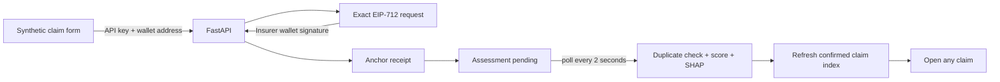
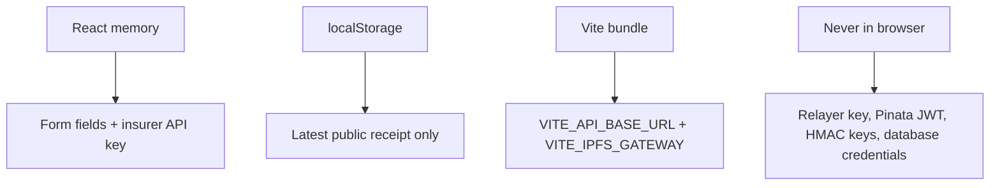

# React frontend

The browser lets a researcher submit a fictional motor claim and follow its
public anchor, screening result, and current Sepolia state. The insurer wallet
signs EIP-712 typed data but never pays gas; Pinata, Kafka, model, database, and
the restricted relayer stay server-side.

## UI flow



The page never treats a model result as a decision. `UnderReview` and `Flagged`
both mean a person would need to review the claim.

## Source map

| File | Owns |
| --- | --- |
| `src/App.tsx` | Page composition and research warnings |
| `src/components/ClaimForm.tsx` | Form state, temporary credential, validation and submission |
| `src/hooks/useClaimsWorkspace.ts` | Pagination, cancellation, detail loading, polling and receipt persistence |
| `src/components/ReceiptCard.tsx` | Anchor, duplicate, score and SHAP presentation |
| `src/components/ClaimsDashboard.tsx` | Newest-first indexed list, checkpoint and selection |
| `src/components/IndexerOperationsDashboard.tsx` | Authenticated lag, counts, reconciliation and recent-event telemetry |
| `src/api.ts` | Gasless fetch calls plus runtime response-shape validation |
| `src/wallet.ts` | Narrow EIP-1193 connect, chain switch, and EIP-712 boundary |
| `src/gasless-submission.ts` | Idempotent prepare, sign, authorize, recovery, and polling workflow |
| `src/display-receipt.ts` | Safe merge of a browser receipt and current chain state |
| `src/receipt-storage.ts` | Latest public submission receipt only |

## Browser data boundary



The insurer credential is cleared when the form resets and is not written to
local storage, URLs, analytics, or logs. Browser storage failures are treated as
a lost convenience, not as an application failure.

## Install and run

Start PostgreSQL, Kafka, migrations, and FastAPI first. The complete order is in
the [local development guide](../../docs/local-development.md). From the
repository root:

```bash
npm --prefix apps/frontend ci

test -f .env.local || cp .env.example .env.local
set -a
source .env.local
set +a

npm --prefix apps/frontend run dev -- --host 127.0.0.1
```

Open <http://127.0.0.1:5173>. A complete submission also requires:

- an EIP-1193 wallet extension enabled in this browser;
- the test wallet address bound to the selected insurer credential;
- Sepolia available in the wallet (the UI asks it to switch networks); and
- the raw insurer API key, not the SHA-256 digest stored by FastAPI.

The wallet signs the exact EIP-712 `ForwardRequest`. It does not send the
transaction and does not pay gas. The isolated relayer performs those steps only
after FastAPI verifies and durably records the signature.

The dedicated indexer dashboard is at <http://127.0.0.1:5173/operations>. For
the checked-in local configuration, use
`local-indexer-operations-key-change-before-hosting`. The raw key is submitted
only as `X-Operations-API-Key` and retained in session storage for the current
tab. If a newly generated raw key is rejected, update the digest in `.env.local`
and fully restart FastAPI; restarting Vite alone cannot change server
authentication. Generate a different high-entropy key before hosting.

| Setting | Default | Browser-visible purpose |
| --- | --- | --- |
| `VITE_API_BASE_URL` | `http://127.0.0.1:8000` | FastAPI base URL |
| `VITE_IPFS_GATEWAY` | `https://gateway.pinata.cloud/ipfs` | Opens the public CID from a receipt |

Every `VITE_` value is bundled into JavaScript. Never use that prefix for a
secret.

## State behaviour

- Preparation can legitimately return `preparing`: another request with the same
  idempotency key is already doing IPFS work. The browser polls rather than
  uploading the same document twice.
- A network error after authorization does not immediately trigger another
  signature. The browser first reads durable state because the original request
  may already have reached FastAPI.
- The wallet is connected and switched using server-authoritative network data
  before claim bytes are pinned.
- A stable idempotency key survives network retry but resets if form content or
  credentials change.
- A successful submission displays the confirmed sponsored transaction, block,
  hash, and CID.
- The workspace polls for up to one minute while the Kafka worker finishes.
- The newest successful public receipt survives a refresh.
- If storage is empty, the newest indexed claim becomes the details view.
- Selecting an older claim shows its chain state immediately, then adds the
  PostgreSQL assessment if one exists.
- Older claims may have an on-chain score without current SHAP or duplicate
  history; the UI says that the detail is unavailable instead of inventing it.
- In-flight list and detail requests are cancelled when dependencies change or
  the component unmounts.
- The operations view refreshes every 15 seconds while visible and preserves the
  last good snapshot through a temporary RPC or API failure.
- The operations event explorer filters by claim ID or full transaction hash,
  event type, state, and block range. Search pages are independent of telemetry
  polling and use stable Newer/Older keyset navigation.
- The operations key is never compiled into the Vite bundle and closing the tab
  clears its session storage.

## Verify

```bash
npm --prefix apps/frontend test
npm --prefix apps/frontend run lint
npm --prefix apps/frontend run build
npm --prefix apps/frontend exec -- playwright install chromium
npm --prefix apps/frontend run test:e2e
```

Vitest covers API validation, receipt merging and browser storage. Playwright
intercepts `/api` calls and verifies submission, polling, pagination, and the
review-only duplicate experience without contacting Sepolia.

## Safety limits

- Evidence upload is intentionally absent while IPFS is public and unencrypted.
- The dashboard uses a confirmed-event PostgreSQL projection. It reports the
  indexed-through block and can temporarily lag the chain.
- A duplicate match and XGBoost score are review signals only.
- Use only fictional policy, claimant, and incident information.

See the [backend guide](../backend/README.md) for local credentials and the
[root runbook](../../README.md) for the complete process order.
