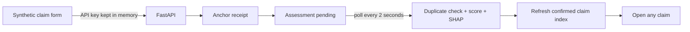

# React frontend

The browser lets a researcher submit a fictional motor claim and follow its
public anchor, screening result, and current Sepolia state. It talks only to
FastAPI; wallet, Pinata, Kafka, model, and database access stay server-side.

## UI flow



The page never treats a model result as a decision. `UnderReview` and `Flagged`
both mean a person would need to review the claim.

## Source map

| File | Owns |
| --- | --- |
| `src/App.tsx` | Page composition and research warnings |
| `src/components/ClaimForm.tsx` | Form state, temporary credential, validation and submission |
| `src/hooks/useClaimsWorkspace.ts` | Pagination, cancellation, detail loading, polling and receipt persistence |
| `src/components/ReceiptCard.tsx` | Anchor, duplicate, score and SHAP presentation |
| `src/components/ClaimsDashboard.tsx` | Newest-first indexed list, checkpoint and selection |
| `src/api.ts` | Fetch calls plus runtime response-shape validation |
| `src/display-receipt.ts` | Safe merge of a browser receipt and current chain state |
| `src/receipt-storage.ts` | Latest public submission receipt only |

## Browser data boundary


The insurer credential is cleared when the form resets and is not written to
local storage, URLs, analytics, or logs. Browser storage failures are treated as
a lost convenience, not as an application failure.

## Install and run

From the repository root:

```bash
npm --prefix apps/frontend ci

cp .env.example .env.local
set -a
source .env.local
set +a

npm --prefix apps/frontend run dev -- --host 127.0.0.1
```

Start FastAPI first, then open <http://127.0.0.1:5173>.

| Setting | Default | Browser-visible purpose |
| --- | --- | --- |
| `VITE_API_BASE_URL` | `http://127.0.0.1:8000` | FastAPI base URL |
| `VITE_IPFS_GATEWAY` | `https://gateway.pinata.cloud/ipfs` | Opens the public CID from a receipt |

Every `VITE_` value is bundled into JavaScript. Never use that prefix for a
secret.

## State behaviour

- A successful submission displays the transaction, block, hash, and CID
  immediately.
- The workspace polls for up to one minute while the Kafka worker finishes.
- The newest successful public receipt survives a refresh.
- If storage is empty, the newest indexed claim becomes the details view.
- Selecting an older claim shows its chain state immediately, then adds the
  PostgreSQL assessment if one exists.
- Older claims may have an on-chain score without current SHAP or duplicate
  history; the UI says that the detail is unavailable instead of inventing it.
- In-flight list and detail requests are cancelled when dependencies change or
  the component unmounts.

## Verify

```bash
npm --prefix apps/frontend test
npm --prefix apps/frontend run lint
npm --prefix apps/frontend run build
npm --prefix apps/frontend exec -- playwright install chromium
npm --prefix apps/frontend run test:e2e
```

Vitest covers API validation, receipt merging and browser storage. Playwright
intercepts `/api` calls and verifies submission, polling, pagination, and the
review-only duplicate experience without contacting Sepolia.

## Safety limits

- Evidence upload is intentionally absent while IPFS is public and unencrypted.
- The dashboard uses a confirmed-event PostgreSQL projection. It reports the
  indexed-through block and can temporarily lag the chain.
- A duplicate match and XGBoost score are review signals only.
- Use only fictional policy, claimant, and incident information.

See the [backend guide](../backend/README.md) for local credentials and the
[root runbook](../../README.md) for the complete process order.
