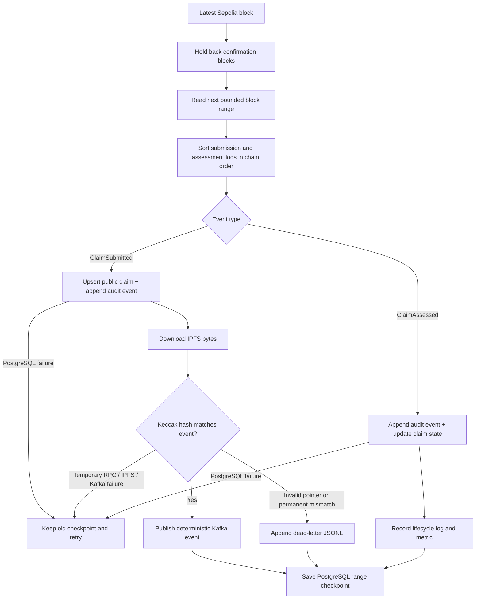
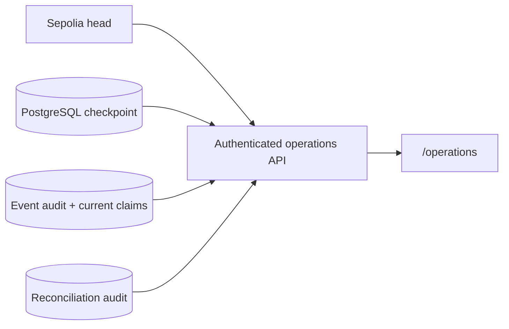

# Blockchain listener and claims indexer

The listener turns confirmed Sepolia logs into a durable PostgreSQL claims index
and verified Kafka events. It does not trust the browser receipt or original API
response: it downloads the CID from the immutable event and hashes those bytes
again before scoring publication.

## Quick mental model

The listener is the **chain-to-application bridge**. It treats confirmed logs as
the source of public history and converts them into forms that the API and
worker can consume efficiently.

| Boundary | Listener responsibility |
| --- | --- |
| Reads | Sepolia blocks/logs and public IPFS bytes |
| Verifies | Confirmation depth, event order, safe pointer shape and exact Keccak-256 byte hash |
| Writes | Immutable index events, current PostgreSQL projection, deployment checkpoint, dead letters and Kafka references |
| Retries | Temporary RPC, IPFS, PostgreSQL and Kafka failures without moving the checkpoint |
| Must not own | A transaction wallet, Pinata upload token, claimant credential, permit key or scoring model |

If the listener crashes, the desired behaviour is repetition—not guessing.
Deterministic event IDs and idempotent database operations make that repetition
safe.

## Processing loop



The deployment-scoped PostgreSQL checkpoint moves only after every event in the
range has either succeeded or been durably quarantined. A restart therefore
replays work rather than skipping an uncertain block. Event IDs and projection
upserts are idempotent, and chain-position checks prevent an older replay from
regressing a newer assessment.

## Files

| File | Responsibility |
| --- | --- |
| `claims_listener.py` | Confirmed polling, PostgreSQL indexing, verification and Kafka bridge |
| `reconcile_claim_index.py` | Non-repairing comparison plus compact operations audit result |
| `block_cursor.py` | Legacy local checkpoint retained for focused compatibility tests |
| `submit_and_assess_demo.py` | Trusted terminal-only submission and assessment demo |
| `.state/` | Ignored dead-letter files; normal checkpoints live in PostgreSQL |

IPFS and Kafka clients live in `packages/integrations/` so polling logic remains
testable without a live network.

## Run

Start PostgreSQL, Kafka, the deployment-specific topic, and migrations first.
Then reuse the repository Python environment:

```bash
test -f .env.local || cp .env.example .env.local
set -a
source .env.local
set +a

# The listener reads public chain/IPFS data and must not inherit wallet keys.
unset SEPOLIA_DEPLOYER_PRIVATE_KEY SEPOLIA_ASSESSOR_PRIVATE_KEY
unset SEPOLIA_RELAYER_PRIVATE_KEY SEPOLIA_RELAYER_PRIVATE_KEY_FILE

apps/backend/.venv/bin/python -m apps.listener.claims_listener
```

Using the explicit interpreter path avoids accidentally selecting a different
`.venv`. The listener imports PostgreSQL, Prometheus, Web3, IPFS and Kafka
adapters at startup, so an incomplete environment otherwise tends to appear as
one missing-module error at a time.

A healthy path emits structured events similar to:

```text
listener.started
listener.checkpoint_loaded
ipfs.verified
kafka.claim_published
claim.assessed
```

## Configuration

| Setting | Default | Purpose |
| --- | --- | --- |
| `SEPOLIA_RPC_URL` | Public Sepolia endpoint | Reads blocks and logs |
| `CLAIMS_DEPLOYMENT_ID` | Required | Selects one checked-in address and ABI |
| `DATABASE_URL` | Required | Durable claim projection, event history, and checkpoint |
| `CONFIRMATION_BLOCKS` | `12` | Holds back the newest blocks for reorganization safety |
| `MAX_BLOCK_RANGE` | `50` | Bounds each public RPC log query |
| `POLL_INTERVAL` | `5` | Wait at the confirmed head; not used between backfill chunks |
| `LISTENER_STATE_DIR` | `apps/listener/.state` | Dead-letter directory |
| `LISTENER_START_BLOCK` | Required | Contract deployment block used by a fresh index |
| `KAFKA_ENABLED` | `false` in code, `true` in `.env.example` | Enables publication after verification |

Every index key and checkpoint includes chain ID and contract address. Switching
deployments cannot accidentally reuse another contract's claims or progress.

`MAX_BLOCK_RANGE` is a query-size control, not a required value. At `50`, a
3,600-block backlog needs 72 bounded ranges; `250` reduces that to 15 ranges and
`500` to 8. Fewer ranges can accelerate a controlled catch-up because the
listener makes fewer RPC round trips. The trade-off is that each `eth_getLogs`
query becomes heavier and may exceed the provider's timeout, response-size, or
rate-limit policy. Keep `50` as the conservative public-RPC default, test a
temporary increase against the selected provider, and reduce it again if
`listener.poll_failed` appears. A failed range does not advance the durable
checkpoint, so it is retried rather than skipped.

The normal listener needs no wallet, Pinata upload token, insurer credential,
or claim-authorization key. It has only public chain/IPFS read access and Kafka
publication access.

## First run, backfill, and reconciliation

A new index refuses to start without `LISTENER_START_BLOCK`. Beginning at the
current head would look healthy while silently omitting historical claims. Use
the deployment's exact registry block:

| Deployment | Start block | Intended use |
| --- | ---: | --- |
| `sepolia-public-intake-v1` | `11516697` | Current permit-backed writer |
| `sepolia-gasless-v1` | `11426492` | Previous gasless history; no public permits |
| `sepolia-security-audit-v1` | `11377814` | Hardened non-gasless history |

Never mix a start block with a different deployment ID. The database checkpoint
is address-scoped, but a wrong initial block can still omit that deployment's
early events.

For a deliberate full rebuild, isolate the affected deployment and:

1. Stop the listener.
2. Back up PostgreSQL.
3. Remove only that chain/address's rows from `claim_index_checkpoints`,
   `indexed_claims`, and `claim_index_events` in a reviewed transaction.
4. Confirm `LISTENER_START_BLOCK` is the deployment block.
5. Restart and watch the checkpoint and listener block-lag metric.

Replays are at-least-once: the deterministic event ID and PostgreSQL constraints
make duplicate delivery safe.

After catch-up, temporarily stop the listener and compare every indexed claim
with the contract:

```bash
apps/backend/.venv/bin/python -m apps.listener.reconcile_claim_index
```

The command prints JSON and exits non-zero for missing, unexpected, or stale
claims. It deliberately does not repair rows from a point-in-time read; replaying
events preserves the complete audit history. It appends only the compact result
and duration to `claim_index_reconciliations`, allowing the authenticated
`/operations` dashboard to show the most recent proof of consistency.

Do not discard the dead-letter file without reviewing why its immutable events
were rejected.

## Legacy terminal-only diagnostic

The gasless web API and isolated relayer are the normal submission route. This
direct-wallet script remains only for a trusted operator diagnostic:

```bash
set -a
source .env.local
set +a
apps/backend/.venv/bin/python -m apps.listener.submit_and_assess_demo
```

This script also needs the Pinata JWT, `CLAIM_AUTHORIZATION_KEY`, and separate
submitter and assessor keys. It is not a browser client. If assessment was
interrupted after a successful submission, continue the existing claim:

```bash
apps/backend/.venv/bin/python \
  -m apps.listener.submit_and_assess_demo --assess-existing 1
```

Replace `1` with the actual claim ID.

## Test

```bash
apps/backend/.venv/bin/python -m pytest apps/listener/test_*.py -q
```

Tests inject chain, IPFS, Kafka, index, checkpoint, and dead-letter adapters.
They cover event ordering, bounded catch-up, tamper rejection, replay, database
checkpoint safety, and contract/index reconciliation without public services.

See the [Kafka guide](../../packages/integrations/kafka/README.md) and the
[local development guide](../../LOCAL_DEVELOPMENT.md).

---

## Indexer operations runbook

The `/operations` page is the authenticated, read-only control-room view for the
Sepolia claim index. It combines a current RPC head sample with a bounded
PostgreSQL snapshot. It never submits a transaction, modifies an indexed claim,
resets a checkpoint, or starts a replay.

### Data path



Normal claim traffic does not use this path. `/claims` remains a PostgreSQL-only
query so a slow RPC cannot slow the public claims dashboard.

### Credential preparation

Generate a dedicated high-entropy credential:

```bash
apps/backend/.venv/bin/python \
  apps/backend/scripts/generate_operations_credential.py
```

The command prints the raw key once and its SHA-256 digest. Give the raw key to
trusted operators through an approved secret channel. Put only the digest in
the API environment:

```text
INDEXER_OPERATIONS_API_KEY_SHA256=<64 lowercase hexadecimal characters>
```

Never use a `VITE_` variable for the key or digest. A Vite value is public in the
compiled browser bundle. The browser sends the raw key in
`X-Operations-API-Key` and keeps it in `sessionStorage` only for the current tab.
Use HTTPS for every hosted deployment and prefer an identity-aware proxy in
front of this application-level credential.

To rotate access, generate a new key, replace the server-side digest, restart the
API, and distribute the new raw key. Existing browser sessions fail closed with
HTTP 401 and return to the unlock screen.

### Deployment order

1. Back up PostgreSQL according to the environment's normal policy.
2. Apply all current migrations, including `003_claim_index_operations.sql` and
   `004_claim_index_event_search.sql`.
3. Confirm the migration check succeeds using the command from the local
   development guide.
4. Configure the operations digest, stale threshold, and the same
   `CONFIRMATION_BLOCKS` value used by the listener.
5. Deploy or restart FastAPI and the frontend.
6. Open `/operations`, authenticate, and confirm the selected deployment and
   contract address before trusting the remaining metrics.
7. Run one reconciliation after the listener catches up so the dashboard has a
   baseline consistency result.

The API readiness check fails when operations authentication is absent or
malformed. This prevents a deployment from appearing fully ready while its
protected operator surface is unusable.

### State interpretation

| State | Meaning | First response |
| --- | --- | --- |
| `healthy` | Checkpoint reached the confirmed head | No action |
| `catching_up` | Behind, but checkpoint age is below the stale threshold | Watch that lag decreases |
| `stalled` | Behind and checkpoint has not advanced within the threshold | Inspect listener errors, RPC, IPFS, Kafka and PostgreSQL |
| `uninitialized` | No checkpoint exists for the selected chain/address | Verify migrations and `LISTENER_START_BLOCK`, then start listener |
| `degraded` | RPC unavailable or returned a head older than the checkpoint | Check provider/network; database totals remain useful |

The confirmed head is `latest block - CONFIRMATION_BLOCKS`. A small non-zero lag
can be normal between listener polls. Alert on sustained state rather than one
sample. The default `INDEXER_STALE_AFTER_SECONDS=120` is intentionally longer
than ordinary Sepolia block and listener polling intervals.

### Routine checks

- Keep the listener running under a supervisor with automatic restart.
- Alert when `claims_listener_block_lag` stays above zero beyond the stale
  threshold, or when `claims_listener_poll_errors_total` increases.
- Review recent events for continued block and log-index progression.
- Use the event explorer to isolate one claim, a full transaction hash, event
  type, state, or inclusive block range. Identity search accepts a numeric claim
  ID (with an optional `#`) or a complete 66-character transaction hash.
- Event pages do not auto-refresh. Health telemetry continues refreshing above
  them, while Newer/Older keyset navigation preserves a stable investigation as
  newly confirmed events arrive. Clear or submit the filters again to start from
  the current newest matching event.
- Run reconciliation after deployments, backfills, RPC-provider changes, or an
  indexing incident. A daily scheduled reconciliation is reasonable for this
  small registry; large registries should choose a lower-frequency window
  because reconciliation performs one pinned contract read per claim.
- Treat an old reconciliation as unknown correctness, not proof of a current
  mismatch. Compare its snapshot block with the current indexed-through block.

Use the CLI while the listener is caught up and temporarily stopped:

```bash
apps/backend/.venv/bin/python -m apps.listener.reconcile_claim_index
```

Both successful and unsuccessful comparisons are appended to
`claim_index_reconciliations`. The command exits non-zero on missing, unexpected,
or mismatched claims, making it suitable for scheduled-job alerting.

### Incident response

#### Lag grows but checkpoint still moves

The listener is catching up. Confirm that block lag trends downward. A reviewed
temporary increase to `MAX_BLOCK_RANGE` can reduce RPC round trips, but revert it
if the provider returns timeouts, rate limits, or oversized-response errors.

#### Lag grows and checkpoint is stale

Inspect structured `listener.poll_failed` logs and Prometheus counters. Fix the
failing dependency first. The checkpoint advances only after a complete range,
so restarting the listener safely retries the same events.

#### Reconciliation reports a mismatch

1. Stop the listener.
2. Preserve logs, the reconciliation JSON, and a database backup.
3. Confirm the selected chain ID, deployment ID, address and deployment block.
4. Remove only that deployment's checkpoint, projection and event-audit rows in
   a reviewed transaction.
5. Replay from `LISTENER_START_BLOCK`.
6. Reconcile again before restoring normal operation.

Do not repair individual rows from live contract reads. That would hide the
cause and destroy the guarantee that every projection value is derived from the
immutable event history.

### Security and availability boundary

The operations response contains public chain/event values and internal service
health metadata, but no IPFS claim bodies, insurer credentials, database URL,
wallet key, Pinata token, raw RPC URL, or exception message. Authentication is
still required because deployment health and incident timing are operationally
sensitive.

This repository's included Compose deployment is single-node research
infrastructure, not highly available production infrastructure. A real
production environment still needs replicated PostgreSQL, redundant indexer
instances with coordinated ownership, managed secrets, HTTPS/enterprise
identity, alert routing, backups, and an explicit deep-reorganization recovery
procedure.

For the exact local terminal order, environment-loading commands, and readiness
checks, see the [local development guide](../../LOCAL_DEVELOPMENT.md).
