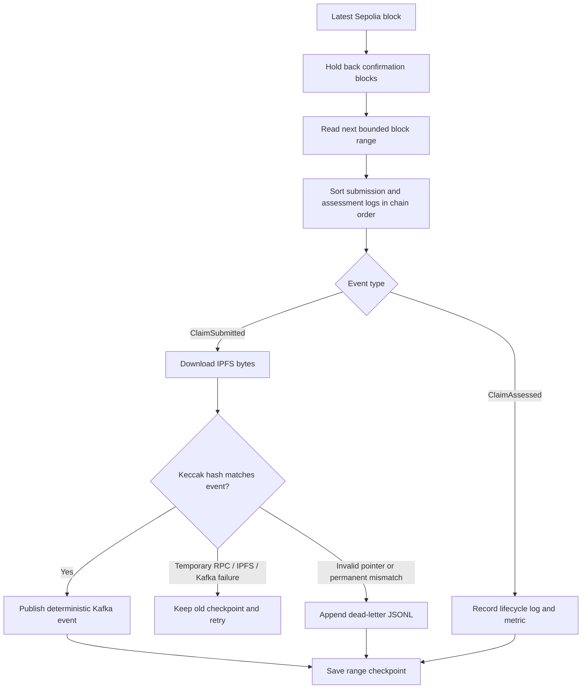

# Blockchain listener

The listener turns confirmed Sepolia logs into verified Kafka events. It does
not trust the browser receipt or the original API response: it downloads the
CID from the immutable contract event and hashes those bytes again.

## Processing loop



The checkpoint moves only after every event in the range has either succeeded
or been durably quarantined. A restart therefore replays work rather than
skipping an uncertain block.

## Files

| File | Responsibility |
| --- | --- |
| `claims_listener.py` | Confirmed block polling, event verification and Kafka bridge |
| `block_cursor.py` | Atomic deployment-scoped checkpoint file |
| `submit_and_assess_demo.py` | Trusted terminal-only submission and assessment demo |
| `.state/` | Ignored local checkpoints and dead-letter files |

IPFS and Kafka clients live in `packages/integrations/` so polling logic remains
testable without a live network.

## Run

Reuse the repository Python environment:

```bash
source apps/backend/.venv/bin/activate
python -m pip install --require-hashes -r requirements-dev.lock

cp .env.example .env.local
set -a
source .env.local
set +a

python -m apps.listener.claims_listener
```

A healthy path emits structured events similar to:

```text
listener.started
listener.checkpoint_loaded
ipfs.verified
kafka.claim_published
claim.assessed
```

## Configuration

| Setting | Default | Purpose |
| --- | --- | --- |
| `SEPOLIA_RPC_URL` | Public Sepolia endpoint | Reads blocks and logs |
| `CLAIMS_DEPLOYMENT_ID` | Required | Selects one checked-in address and ABI |
| `CONFIRMATION_BLOCKS` | `2` | Holds back the newest blocks for reorganization safety |
| `MAX_BLOCK_RANGE` | `50` | Bounds each public RPC log query |
| `POLL_INTERVAL` | `5` | Wait at the confirmed head; not used between backfill chunks |
| `LISTENER_STATE_DIR` | `apps/listener/.state` | Checkpoint and dead-letter directory |
| `LISTENER_START_BLOCK` | Current safe head | Initial block for an intentional backfill |
| `KAFKA_ENABLED` | `false` in code, `true` in `.env.example` | Enables publication after verification |

State filenames include deployment ID, chain ID, and contract address. Switching
deployments cannot accidentally reuse another contract's checkpoint.

The normal listener needs no wallet, Pinata upload token, insurer credential,
or claim-authorization key. It has only public chain/IPFS read access and Kafka
publication access.

## First run and backfill

By default, a new listener begins at the latest safely confirmed block. Start it
before submitting if you want only new claims.

For a deliberate historical replay:

1. Stop the listener.
2. Archive the deployment-specific checkpoint from `LISTENER_STATE_DIR`.
3. Set `LISTENER_START_BLOCK` to the required block.
4. Restart and watch the checkpoint and Kafka lag.

The checked-in hardened contract was deployed at Sepolia block `11377814`.
Replays are at-least-once: the deterministic event ID and PostgreSQL constraints
make duplicate delivery safe.

Do not discard the dead-letter file without reviewing why its immutable events
were rejected.

## Terminal-only demo

The web API is the normal submission route. For a trusted operator demo that
uses both role wallets:

```bash
set -a
source .env.local
set +a
python -m apps.listener.submit_and_assess_demo
```

This script also needs the Pinata JWT, `CLAIM_AUTHORIZATION_KEY`, and separate
submitter and assessor keys. It is not a browser client. If assessment was
interrupted after a successful submission, continue the existing claim:

```bash
python -m apps.listener.submit_and_assess_demo --assess-existing 1
```

Replace `1` with the actual claim ID.

## Test

```bash
source apps/backend/.venv/bin/activate
python -m pytest apps/listener/test_*.py -q
```

Tests inject chain, IPFS, Kafka, checkpoint, and dead-letter adapters. They cover
event ordering, bounded catch-up, tamper rejection, replay, and checkpoint
safety without using public services.

See the [Kafka guide](../../packages/integrations/kafka/README.md) and the
[root runbook](../../README.md).
