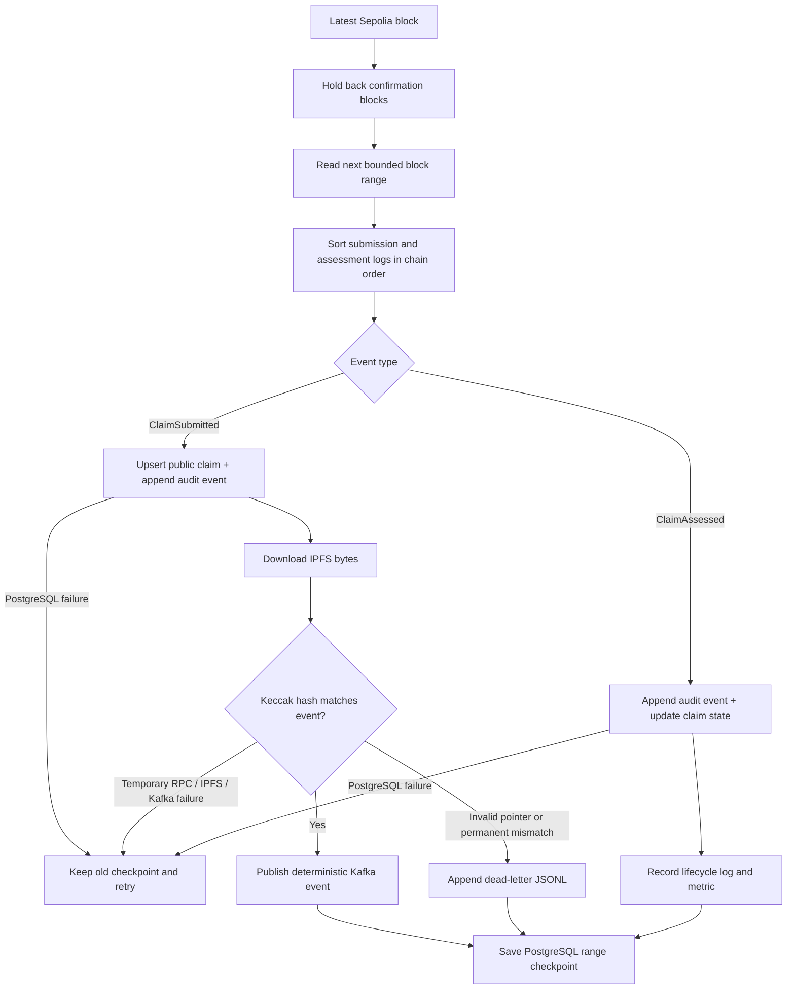

# Blockchain listener and claims indexer

The listener turns confirmed Sepolia logs into a durable PostgreSQL claims index
and verified Kafka events. It does not trust the browser receipt or original API
response: it downloads the CID from the immutable event and hashes those bytes
again before scoring publication.

## Processing loop



The deployment-scoped PostgreSQL checkpoint moves only after every event in the
range has either succeeded or been durably quarantined. A restart therefore
replays work rather than skipping an uncertain block. Event IDs and projection
upserts are idempotent, and chain-position checks prevent an older replay from
regressing a newer assessment.

## Files

| File | Responsibility |
| --- | --- |
| `claims_listener.py` | Confirmed polling, PostgreSQL indexing, verification and Kafka bridge |
| `reconcile_claim_index.py` | Read-only comparison of indexed and authoritative contract state |
| `block_cursor.py` | Legacy local checkpoint retained for focused compatibility tests |
| `submit_and_assess_demo.py` | Trusted terminal-only submission and assessment demo |
| `.state/` | Ignored dead-letter files; normal checkpoints live in PostgreSQL |

IPFS and Kafka clients live in `packages/integrations/` so polling logic remains
testable without a live network.

## Run

Reuse the repository Python environment:

```bash
source apps/backend/.venv/bin/activate
python -m pip install --require-hashes -r requirements-dev.lock

cp .env.example .env.local
set -a
source .env.local
set +a

python -m apps.listener.claims_listener
```

A healthy path emits structured events similar to:

```text
listener.started
listener.checkpoint_loaded
ipfs.verified
kafka.claim_published
claim.assessed
```

## Configuration

| Setting | Default | Purpose |
| --- | --- | --- |
| `SEPOLIA_RPC_URL` | Public Sepolia endpoint | Reads blocks and logs |
| `CLAIMS_DEPLOYMENT_ID` | Required | Selects one checked-in address and ABI |
| `DATABASE_URL` | Required | Durable claim projection, event history, and checkpoint |
| `CONFIRMATION_BLOCKS` | `12` | Holds back the newest blocks for reorganization safety |
| `MAX_BLOCK_RANGE` | `50` | Bounds each public RPC log query |
| `POLL_INTERVAL` | `5` | Wait at the confirmed head; not used between backfill chunks |
| `LISTENER_STATE_DIR` | `apps/listener/.state` | Dead-letter directory |
| `LISTENER_START_BLOCK` | Required | Contract deployment block used by a fresh index |
| `KAFKA_ENABLED` | `false` in code, `true` in `.env.example` | Enables publication after verification |

Every index key and checkpoint includes chain ID and contract address. Switching
deployments cannot accidentally reuse another contract's claims or progress.

`MAX_BLOCK_RANGE` is a query-size control, not a required value. At `50`, a
3,600-block backlog needs 72 bounded ranges; `250` reduces that to 15 ranges and
`500` to 8. Fewer ranges can accelerate a controlled catch-up because the
listener makes fewer RPC round trips. The trade-off is that each `eth_getLogs`
query becomes heavier and may exceed the provider's timeout, response-size, or
rate-limit policy. Keep `50` as the conservative public-RPC default, test a
temporary increase against the selected provider, and reduce it again if
`listener.poll_failed` appears. A failed range does not advance the durable
checkpoint, so it is retried rather than skipped.

The normal listener needs no wallet, Pinata upload token, insurer credential,
or claim-authorization key. It has only public chain/IPFS read access and Kafka
publication access.

## First run, backfill, and reconciliation

A new index refuses to start without `LISTENER_START_BLOCK`. Beginning at the
current head would look healthy while silently omitting historical claims. The
checked-in hardened contract was deployed at Sepolia block `11377814`, which is
therefore the example value.

For a deliberate full rebuild, isolate the affected deployment and:

1. Stop the listener.
2. Back up PostgreSQL.
3. Remove only that chain/address's rows from `claim_index_checkpoints`,
   `indexed_claims`, and `claim_index_events` in a reviewed transaction.
4. Confirm `LISTENER_START_BLOCK` is the deployment block.
5. Restart and watch the checkpoint and listener block-lag metric.

Replays are at-least-once: the deterministic event ID and PostgreSQL constraints
make duplicate delivery safe.

After catch-up, temporarily stop the listener and compare every indexed claim
with the contract:

```bash
python -m apps.listener.reconcile_claim_index
```

The command prints JSON and exits non-zero for missing, unexpected, or stale
claims. It deliberately does not repair rows from a point-in-time read; replaying
events preserves the complete audit history.

Do not discard the dead-letter file without reviewing why its immutable events
were rejected.

## Terminal-only demo

The web API is the normal submission route. For a trusted operator demo that
uses both role wallets:

```bash
set -a
source .env.local
set +a
python -m apps.listener.submit_and_assess_demo
```

This script also needs the Pinata JWT, `CLAIM_AUTHORIZATION_KEY`, and separate
submitter and assessor keys. It is not a browser client. If assessment was
interrupted after a successful submission, continue the existing claim:

```bash
python -m apps.listener.submit_and_assess_demo --assess-existing 1
```

Replace `1` with the actual claim ID.

## Test

```bash
source apps/backend/.venv/bin/activate
python -m pytest apps/listener/test_*.py -q
```

Tests inject chain, IPFS, Kafka, index, checkpoint, and dead-letter adapters.
They cover event ordering, bounded catch-up, tamper rejection, replay, database
checkpoint safety, and contract/index reconciliation without public services.

See the [Kafka guide](../../packages/integrations/kafka/README.md) and the
[root runbook](../../README.md).
