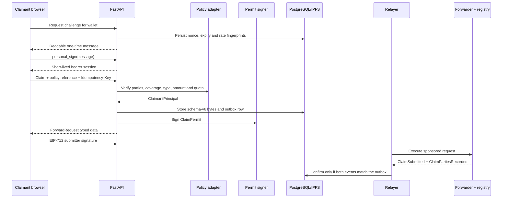

# Public claim intake

The public intake flow replaces the earlier insurer-only browser gate. Anyone
can start the flow, but a wallet can submit only when the backend verifies the
policy, incident-date coverage, claim type, and the wallet's relationship to the
claimant.

## Trust and party model

| Party | Proof | Permanent authority |
| --- | --- | --- |
| Claimant | Verified policy relationship | None |
| Submitter | One-time wallet challenge and ERC-2771 signature | None |
| Insurer | On-chain `SUBMITTER_ROLE` plus configured policy record | Insurer scope only |
| Permit issuer | EIP-712 signature binding one claim | `PERMIT_ISSUER_ROLE` for one insurer |
| Relayer | Pays for the already-authorized forwarder call | No registry role |
| Assessor | Updates lifecycle after fraud screening | `ASSESSOR_ROLE` for one insurer |

Claimant and submitter can be different. A representative signs with their own
wallet while the permit and resulting `ClaimSubmitted` event continue to name
the policyholder as claimant. `ClaimPartiesRecorded` preserves that distinction.

## End-to-end sequence

## Configuration and deployment

1. Deploy `ClaimsForwarder` and the current `ClaimsRegistry`.
   Admin, insurer, permit issuer, assessor, and relayer must be separate accounts.
2. Store the Ignition output under a new deployment ID and set
   `CLAIMS_DEPLOYMENT_ID`. Old artifacts fail `require_public_intake()`.
3. Give the insurer `SUBMITTER_ROLE`, then scope the non-paying eligibility key
   with `setPermitIssuer(issuer, insurer, true)`.
4. Put each permit private key in an absolute owner-only (`0600`) file and map it
   to the insurer ID through `CLAIM_PERMIT_ISSUERS_JSON`. A hosted deployment
   should replace the file adapter with a managed signer implementing the same
   signing interface.
5. Configure wallet-session keys and the policy adapter values documented in
   `.env.example`. Raw policy references are not stored in the adapter or outbox;
   `POLICY_ELIGIBILITY_RECORDS_JSON` uses a keyed reference digest.
6. Apply PostgreSQL migrations before starting FastAPI. Readiness verifies the
   schema, public ABI, insurer role, permit-issuer scope, policy configuration,
   claimant authentication, IPFS, and authorization keys.

The checked-in policy adapter is for controlled research. A real insurer would
replace it with its policy and identity systems. Those systems would return the
same `ClaimantPrincipal` only after completing the insurer's checks for identity,
policy ownership, coverage, delegation, sanctions, consent, and jurisdiction.
The route and chain layers should not need to change.

## Security properties

- Challenges are short-lived, rate-limited in PostgreSQL, and consumed once.
- Bearer sessions are HMAC-signed, short-lived, stored only in browser memory,
  and bind a stable privacy-preserving wallet subject used for outbox ownership.
- Policy references and claimant commitments use separate HMAC keys.
- Claim permits bind claimant, submitter, insurer, claimant commitment, claim
  hash, IPFS pointer hash, deadline, and globally single-use permit ID.
- The forwarder separately binds signer, target, calldata, nonce, deadline, gas,
  value, chain, and verifying contract.
- Confirmation requires matching claim and party events; transaction success
  alone cannot advance the outbox.
- The relayer has no business role and the permit issuer cannot pay, assess, or
  administer claims.

Claim JSON and IPFS pointers remain public and immutable. The current form keeps
evidence uploads disabled; only fictional data is suitable until encrypted,
access-controlled evidence storage and a governed erasure strategy exist.
