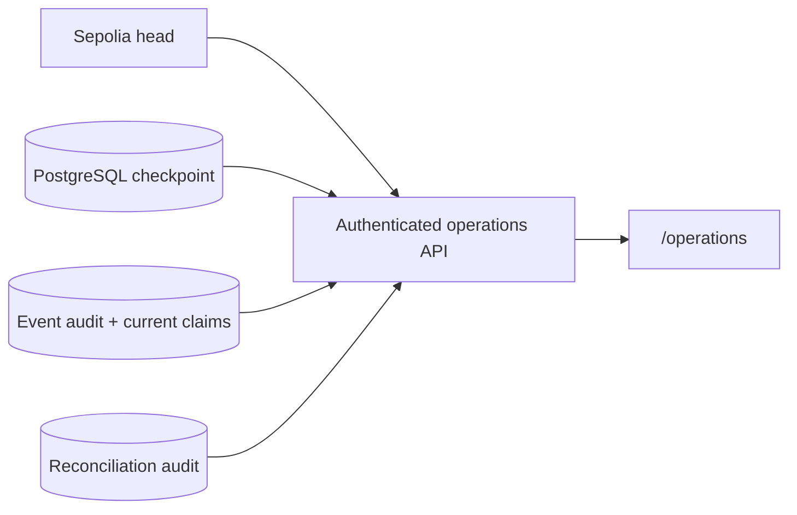

# Indexer operations runbook

The `/operations` page is the authenticated, read-only control-room view for the
Sepolia claim index. It combines a current RPC head sample with a bounded
PostgreSQL snapshot. It never submits a transaction, modifies an indexed claim,
resets a checkpoint, or starts a replay.

## Data path



Normal claim traffic does not use this path. `/claims` remains a PostgreSQL-only
query so a slow RPC cannot slow the public claims dashboard.

## Credential preparation

Generate a dedicated high-entropy credential:

```bash
python apps/backend/scripts/generate_operations_credential.py
```

The command prints the raw key once and its SHA-256 digest. Give the raw key to
trusted operators through an approved secret channel. Put only the digest in
the API environment:

```text
INDEXER_OPERATIONS_API_KEY_SHA256=<64 lowercase hexadecimal characters>
```

Never use a `VITE_` variable for the key or digest. A Vite value is public in the
compiled browser bundle. The browser sends the raw key in
`X-Operations-API-Key` and keeps it in `sessionStorage` only for the current tab.
Use HTTPS for every hosted deployment and prefer an identity-aware proxy in
front of this application-level credential.

To rotate access, generate a new key, replace the server-side digest, restart the
API, and distribute the new raw key. Existing browser sessions fail closed with
HTTP 401 and return to the unlock screen.

## Deployment order

1. Back up PostgreSQL according to the environment's normal policy.
2. Apply migration `003_claim_index_operations.sql`.
3. Confirm `python -m packages.integrations.postgres.migrations check` succeeds.
4. Configure the operations digest, stale threshold, and the same
   `CONFIRMATION_BLOCKS` value used by the listener.
5. Deploy or restart FastAPI and the frontend.
6. Open `/operations`, authenticate, and confirm the selected deployment and
   contract address before trusting the remaining metrics.
7. Run one reconciliation after the listener catches up so the dashboard has a
   baseline consistency result.

The API readiness check fails when operations authentication is absent or
malformed. This prevents a deployment from appearing fully ready while its
protected operator surface is unusable.

## State interpretation

| State | Meaning | First response |
| --- | --- | --- |
| `healthy` | Checkpoint reached the confirmed head | No action |
| `catching_up` | Behind, but checkpoint age is below the stale threshold | Watch that lag decreases |
| `stalled` | Behind and checkpoint has not advanced within the threshold | Inspect listener errors, RPC, IPFS, Kafka and PostgreSQL |
| `uninitialized` | No checkpoint exists for the selected chain/address | Verify migrations and `LISTENER_START_BLOCK`, then start listener |
| `degraded` | RPC unavailable or returned a head older than the checkpoint | Check provider/network; database totals remain useful |

The confirmed head is `latest block - CONFIRMATION_BLOCKS`. A small non-zero lag
can be normal between listener polls. Alert on sustained state rather than one
sample. The default `INDEXER_STALE_AFTER_SECONDS=120` is intentionally longer
than ordinary Sepolia block and listener polling intervals.

## Routine checks

- Keep the listener running under a supervisor with automatic restart.
- Alert when `claims_listener_block_lag` stays above zero beyond the stale
  threshold, or when `claims_listener_poll_errors_total` increases.
- Review recent events for continued block and log-index progression.
- Run reconciliation after deployments, backfills, RPC-provider changes, or an
  indexing incident. A daily scheduled reconciliation is reasonable for this
  small registry; large registries should choose a lower-frequency window
  because reconciliation performs one pinned contract read per claim.
- Treat an old reconciliation as unknown correctness, not proof of a current
  mismatch. Compare its snapshot block with the current indexed-through block.

Use the CLI while the listener is caught up and temporarily stopped:

```bash
python -m apps.listener.reconcile_claim_index
```

Both successful and unsuccessful comparisons are appended to
`claim_index_reconciliations`. The command exits non-zero on missing, unexpected,
or mismatched claims, making it suitable for scheduled-job alerting.

## Incident response

### Lag grows but checkpoint still moves

The listener is catching up. Confirm that block lag trends downward. A reviewed
temporary increase to `MAX_BLOCK_RANGE` can reduce RPC round trips, but revert it
if the provider returns timeouts, rate limits, or oversized-response errors.

### Lag grows and checkpoint is stale

Inspect structured `listener.poll_failed` logs and Prometheus counters. Fix the
failing dependency first. The checkpoint advances only after a complete range,
so restarting the listener safely retries the same events.

### Reconciliation reports a mismatch

1. Stop the listener.
2. Preserve logs, the reconciliation JSON, and a database backup.
3. Confirm the selected chain ID, deployment ID, address and deployment block.
4. Remove only that deployment's checkpoint, projection and event-audit rows in
   a reviewed transaction.
5. Replay from `LISTENER_START_BLOCK`.
6. Reconcile again before restoring normal operation.

Do not repair individual rows from live contract reads. That would hide the
cause and destroy the guarantee that every projection value is derived from the
immutable event history.

## Security and availability boundary

The operations response contains public chain/event values and internal service
health metadata, but no IPFS claim bodies, insurer credentials, database URL,
wallet key, Pinata token, raw RPC URL, or exception message. Authentication is
still required because deployment health and incident timing are operationally
sensitive.

This repository's included Compose deployment is single-node research
infrastructure, not highly available production infrastructure. A real
production environment still needs replicated PostgreSQL, redundant indexer
instances with coordinated ownership, managed secrets, HTTPS/enterprise
identity, alert routing, backups, and an explicit deep-reorganization recovery
procedure.
