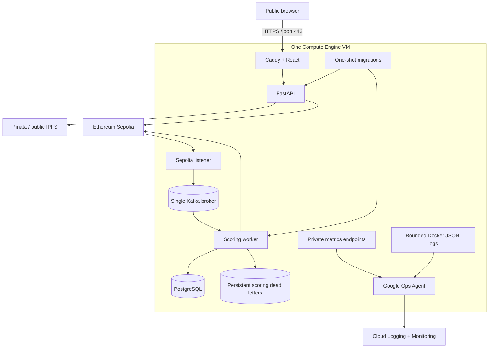
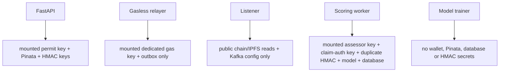

# Google Cloud single-VM research deployment

This folder runs the complete demonstration on one disposable Compute Engine
VM. The single-VM layout is easy to inspect and inexpensive to remove, but it
is not a production insurance platform.

## Quick mental model

The VM is a **research appliance**, not a production cluster. Docker Compose
separates processes and secrets, while all containers still share one machine
and therefore one failure domain.

| Layer | Responsibility |
| --- | --- |
| Terraform | Create the VM, reserved address, network controls, service account and persistent disk |
| Docker images | Build reproducible Python/frontend runtime files from reviewed source |
| Compose | Start dependencies in order, apply migrations, isolate service settings and bind private ports |
| Caddy | Serve the frontend, proxy `/api`, and manage the public TLS certificate |
| Ops Agent | Collect bounded JSON logs and scrape private Prometheus endpoints |
| Evidence scripts | Record versions, health, configuration shape and operational output for the dissertation |

Single-node PostgreSQL and Kafka are honest prototype dependencies: restarting
or losing the VM can interrupt the entire system, and no document should
describe them as a replicated production service.

`Dockerfile.app`, the default Kafka identity, and the listener start block all
select `sepolia-public-intake-v1`. The deployment checks fail closed if the
contract deployment, topic, consumer group, or public-intake configuration
drifts.

## Topology



Only Caddy on HTTP/HTTPS and IAP-controlled SSH are exposed. HTTP is used only
for certificate validation and redirecting browsers to HTTPS. FastAPI,
PostgreSQL, Kafka, and metrics bind to Docker networking or VM loopback.

## Honest scope

| This deployment has | It does not have |
| --- | --- |
| One VM and one failure domain | High availability or automatic failover |
| One Kafka broker, replication factor one | A production event cluster |
| One PostgreSQL container and persistent volume | Managed backups or regional durability |
| Persistent sanitized scoring dead letters | Centralized incident/replay management |
| Automatic HTTPS on a stable generated hostname | A branded domain, WAF or managed load balancer |
| Browser claimant wallets plus mounted relayer, permit and assessor keys | Managed/HSM transaction signing |
| Structured logs and a focused metrics dashboard | Full production incident response |

The public URL is open for anyone to view and verify fictional claims. Creating
a claim remains intentionally restricted to a wallet and synthetic policy in
`POLICY_ELIGIBILITY_RECORDS_JSON`; opening sponsorship to arbitrary internet
wallets would expose the relayer and Pinata account to abuse and is not part of
this deployment.

Review current Google Cloud pricing and your billing account before applying
Terraform. Use a dedicated project, stop the VM when idle, and destroy the
deployment after exporting reviewed evidence. Budget alerts are useful warnings,
not a substitute for removing unused resources.

## Files

| File | Job |
| --- | --- |
| `compose.yml` | Runs application, database, broker, migrations and exporters |
| `Dockerfile.app` | Shared non-root Python runtime for API, listener and worker |
| `Dockerfile.frontend` | Builds React and serves it with Caddy |
| `Caddyfile` | Automatic HTTPS, `/api` proxy, request limit, headers and static caching |
| `.env.gcp.example` | Required settings without real secrets |
| `terraform/` | VM, reserved IP, service account, web firewall, IAP SSH and APIs |
| `monitoring/ops-agent.yaml` | Private Prometheus scraping and Docker log forwarding |
| `monitoring/dashboard.json` | Initial research dashboard |
| `scripts/train-model.sh` | Builds the model in the serving image |
| `scripts/deploy.sh` | Validates configuration and starts Compose |
| `scripts/release-vm.sh` | Installs one reviewed GitHub SHA under a lock, verifies it and attempts code rollback on failure |
| `scripts/verify-deployment.sh` | Safe post-deploy checks |
| `scripts/collect-evidence.sh` | Redactable logs, metrics and container state |
| `scripts/stop.sh` | Stops containers while preserving volumes |

## Deployment path

```mermaid
flowchart LR
    Plan["terraform plan"] --> Apply["terraform apply"]
    Apply --> Clone["Clone reviewed commit on VM"]
    Clone --> Secrets["Create private .env.gcp"]
    Secrets --> Train["Train reviewed model artifact"]
    Train --> Deploy["deploy.sh"]
    Deploy --> Verify["verify-deployment.sh"]
    Verify --> Observe["Logs, metrics, browser test"]
    Observe --> Evidence["collect-evidence.sh"]
    Evidence --> Destroy["terraform destroy"]
```



After the first manual deployment is healthy, the optional keyless GitHub
release path can replace repeated `scp` commands. It is disabled by default and
never deploys on push. Follow [the complete CD runbook](CD_RUNBOOK.md) to review
the trust boundary, enable it with Terraform, configure the protected GitHub
Environment, perform the first release, and roll back to an earlier reviewed
commit.

### 1. Prepare Google Cloud

Install `gcloud` and Terraform locally, then authenticate:

```bash
gcloud auth login
gcloud auth application-default login

export CLAIMS_GCP_PROJECT="your-research-project-id"
gcloud config set project "${CLAIMS_GCP_PROJECT}"
```

The operator needs IAP tunnel access and OS Admin Login for the VM. If those
roles are not already managed by your organization:

```bash
gcloud projects add-iam-policy-binding "${CLAIMS_GCP_PROJECT}" \
  --member="user:YOUR_GOOGLE_ACCOUNT_EMAIL" \
  --role="roles/iap.tunnelResourceAccessor"

gcloud projects add-iam-policy-binding "${CLAIMS_GCP_PROJECT}" \
  --member="user:YOUR_GOOGLE_ACCOUNT_EMAIL" \
  --role="roles/compute.osAdminLogin"
```

### 2. Review and create the VM

```bash
cd infrastructure/gcp/terraform
cp terraform.tfvars.example terraform.tfvars
# Set project_id and review the remaining defaults.

terraform init
terraform fmt -check
terraform validate
terraform plan
terraform apply
terraform output -raw public_host
```

Apply only when the plan shows the expected disposable VM, reserved address,
limited firewall rules, and observability service account. Terraform outputs a
stable HTTPS hostname, public URL, and IAP SSH command. By default the hostname
embeds the reserved IP under `sslip.io`; set `public_host` in `terraform.tfvars`
if you have already pointed your own DNS name at that address.

### 3. Put reviewed code on the VM

Connect with the Terraform IAP command, then:

```bash
cd /opt
sudo git clone \
  https://github.com/ganesh1997oli/Decentralized-Claims-Registry.git \
  decentralized-claims-registry
sudo chown -R "${USER}:${USER}" decentralized-claims-registry
cd decentralized-claims-registry
git switch YOUR_REVIEWED_BRANCH
```

Deploy a reviewed branch or commit. Do not copy local secrets, Terraform state,
or unreviewed evidence to the VM.

### 4. Configure secrets

```bash
cp infrastructure/gcp/.env.gcp.example infrastructure/gcp/.env.gcp
chmod 600 infrastructure/gcp/.env.gcp
```

Copy the `public_host` value from step 2 into `PUBLIC_HOST`,
`FRONTEND_ORIGINS`, `CLAIMANT_AUTH_DOMAIN`, and `CLAIMANT_AUTH_URI`, then
replace every remaining `CHANGE_ME`. Generate independent random values, for
example:

```bash
openssl rand -hex 24
openssl rand -hex 32
```

Create owner-only key mounts. These files contain testnet keys only; the
deployment/admin key must stay offline and must not be copied here:

```bash
install -d -m 700 infrastructure/gcp/.env.gcp-secrets/permit-issuers
install -m 600 /secure/path/northstar-permit-issuer.key \
  infrastructure/gcp/.env.gcp-secrets/permit-issuers/northstar-mutual.key
install -m 600 /secure/path/relayer.key \
  infrastructure/gcp/.env.gcp-secrets/relayer.key
install -m 600 /secure/path/assessor.key \
  infrastructure/gcp/.env.gcp-secrets/assessor.key
```

Set the controlled fictional policy record and its keyed policy-reference digest
using the [public-intake configuration guide](../../apps/backend/README.md). Its
insurer address, claimant/representative wallet, and permit issuer must match the
roles already provisioned on `sepolia-public-intake-v1`.

Create a separate operations credential:

```bash
python apps/backend/scripts/generate_operations_credential.py
```

Give its raw key only to trusted operators and place the printed digest in
`INDEXER_OPERATIONS_API_KEY_SHA256`. The browser operations page is `/operations`;
the public entry point is HTTPS, but an identity-aware proxy is still recommended
before treating the operations page as anything beyond a research surface.

Generate the separate human-review credential in the same digest-only form:

```bash
python apps/backend/scripts/generate_assessor_outcome_credential.py
```

For a supervised dissertation demonstration, you may set:

```dotenv
PUBLIC_DEMO_READ_ONLY="true"
```

This makes only `GET /operations/*`, `GET /assessor/session`, and the assessor
outcome read endpoint available without a key. The interface labels both pages
as a public read-only demo and removes the assessor recording form. The assessor
`POST` endpoint still requires a valid assessor API key. Set the flag back to
`false` and rebuild the frontend for production; operations and assessor reads
then require their separate keys again. The flag is not a secret and must never
be used as an authorization credential.

Keep the non-secret Kafka identity scoped to the selected contract deployment.
The checked-in gasless deployment uses:

```dotenv
KAFKA_CLAIM_SUBMITTED_TOPIC="claims.submitted.sepolia-public-intake-v1"
KAFKA_CONSUMER_GROUP_ID="claims-registry-scorer-sepolia-public-intake-v1"
```

When deploying a replacement contract, use `claims.submitted.<deployment-id>`
and `claims-registry-scorer-<deployment-id>`. The deployment script rejects a
topic or consumer group that does not match `CLAIMS_DEPLOYMENT_ID`. Compose then
passes the same values to topic initialization, listener, worker, and Kafka
exporter so events, offsets, and lag metrics cannot cross deployments.

### Secret ownership



The deployment/admin key must not be copied to the VM. Use URL-safe hexadecimal
for `POSTGRES_PASSWORD` because Compose builds it into a connection URL. Select
a new deployment containing both ClaimsRegistry and ClaimsForwarder; the
checked-in `sepolia-security-audit-v1` artifact is read-only legacy history.

Invalid-attempt limits are process-local in this single-VM topology. Valid
sponsorship quotas and idempotency are transactional in PostgreSQL. Caddy and
FastAPI both enforce a 16 KiB request limit; change both settings together.

This Compose file demonstrates the new process separation but remains a
research topology. Follow the
[production gasless runbook](../../apps/relayer/README.md#production-gasless-claim-transactions) for
contract migration, secret mounts, fee replacement, HA, monitoring, and
incident response.

Keep `ALLOW_RATE_LIMIT_BYPASS="false"` for every public deployment. Use a local
chain rather than the public site for sustained performance testing.

Follow the dedicated
[rate-limiting and authorised test-bypass runbook](../../apps/backend/README.md#public-claim-intake-limits)
for credential preparation, activation checks, audit events, and the shutdown
procedure.

### 5. Train, deploy, and verify

```bash
infrastructure/gcp/scripts/train-model.sh
infrastructure/gcp/scripts/deploy.sh
infrastructure/gcp/scripts/verify-deployment.sh
```

The model directory is mounted read-only into the worker. Normal Compose start
runs migrations before either API or worker becomes available.

Useful read-only commands:

```bash
docker compose \
  --env-file infrastructure/gcp/.env.gcp \
  -f infrastructure/gcp/compose.yml \
  ps

docker compose \
  --env-file infrastructure/gcp/.env.gcp \
  -f infrastructure/gcp/compose.yml \
  logs --follow listener scoring-worker
```

Open the Terraform `application_url` and submit fictional claims only. Caddy
obtains the certificate on first start, so the first HTTPS check can take a
short time while DNS and certificate issuance complete.

## Observability

Install the checked-in Ops Agent configuration after containers are running:

```bash
infrastructure/gcp/scripts/install-ops-agent-config.sh
sudo systemctl status google-cloud-ops-agent --no-pager
```

Create the prepared dashboard from an authenticated machine:

```bash
gcloud monitoring dashboards create \
  --project "${CLAIMS_GCP_PROJECT}" \
  --config-from-file infrastructure/gcp/monitoring/dashboard.json
```

| Metric | Question it answers |
| --- | --- |
| `claims_listener_block_lag` | How far is verified event processing behind Sepolia? |
| `claims_listener_poll_errors_total` | Are retriable listener failures increasing? |
| `claims_listener_kafka_publications_total` | How many verified events reached Kafka? |
| `claims_scoring_events_total{outcome}` | Did worker handlers complete or fail? |
| `claims_scoring_model_inference_seconds` | How long did XGBoost plus SHAP take? |
| `claims_scoring_processing_seconds` | How long did the full database and chain workflow take? |
| `kafka_consumergroup_lag` | How many events are waiting for the worker? |

Use model inference—not full processing time—for the 500 ms research target;
full processing includes public network calls and Ethereum confirmation.

The scoring outcome is `completed`, `failed`, or `quarantined`. A quarantined
event is a permanent immutable-input rejection whose public provenance was
fsync'd before Kafka advanced. A failed event remains eligible for retry.

Suggested alerts for an experiment are sustained listener lag, sustained Kafka
lag, any failed or quarantined scoring event, slow p95 model inference, and a
missing scrape target.

Inspect scoring quarantine records without copying the claim payload:

```bash
docker compose \
  --env-file infrastructure/gcp/.env.gcp \
  -f infrastructure/gcp/compose.yml \
  exec scoring-worker sh -c \
  'find "$SCORING_STATE_DIR" -maxdepth 1 -name "*-dead-letter.jsonl" -print'
```

The `claims-scoring-state` named volume survives container replacement and is
writable only by the one-off ownership initializer and the non-root scoring
worker. If that volume is unavailable, the worker leaves the Kafka
offset uncommitted rather than losing the rejection evidence.

## Evidence and shutdown

Capture a small ignored evidence bundle:

```bash
infrastructure/gcp/scripts/collect-evidence.sh
```

Review it before sharing. Transaction IDs are public, but wallet keys, Pinata
tokens, database passwords, and HMAC keys must never appear.

Stop containers while retaining their named volumes:

```bash
infrastructure/gcp/scripts/stop.sh
```

This does not stop VM billing. Stop the VM for a short pause. When the experiment
is complete, export the reviewed evidence and remove the infrastructure:

```bash
cd infrastructure/gcp/terraform
terraform destroy
```

Confirm in the console that the VM and boot disk are gone.

## Quick diagnosis

| Symptom | First check |
| --- | --- |
| Worker restarts | Model files/checksum, database URL, assessor role, RPC availability |
| Kafka lag stops at one claim | Worker errors and scoring dead-letter volume permissions |
| Listener misses history | PostgreSQL checkpoint and deployment `LISTENER_START_BLOCK` |
| Operations page rejects access | `INDEXER_OPERATIONS_API_KEY_SHA256` and the raw operator key |
| Metrics stay local | Ports `9101`, `9102`, `9308`, then Ops Agent status/logs |
| Browser unavailable | Public DNS, ports 80/443, Caddy certificate logs, frontend health |
| API alive but not ready | `/health/ready` and `database-migrate` result |

The [root runbook](../../README.md) explains the application flow; component
guides explain each process in isolation.
