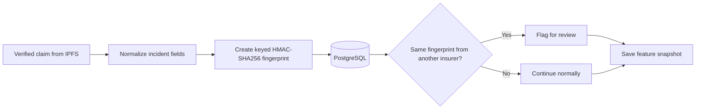

# Cross-insurer duplicate screening

This package checks whether the same incident has already been submitted by a
different insurer. It creates a review signal, not a fraud decision.

## Architecture

`detector.py` normalizes selected incident fields and creates the fingerprint.
`PostgresDuplicateRepository` stores it and searches for the same fingerprint
from another insurer on the same chain and registry contract. The scoring
worker runs this check before saving the claim's feature snapshot.

The fingerprint uses the incident date, amount, claim type, vehicle details,
region, country, and injury/total-loss flags. It excludes insurer, claim and
policy references so that different insurers can produce the same fingerprint.

## Data boundary

The duplicate-matching table stores the fingerprint rather than the canonical
payload. The scoring worker reads the private `DUPLICATE_FINGERPRINT_KEY`, which
must contain at least 32 bytes. A keyed HMAC is used instead of a plain hash to
make offline guessing of predictable claim values more difficult.

In this prototype, cross-insurer matching means different insurer IDs using the
same private service and PostgreSQL database. It does not query independent
databases owned by other insurers.

## Limitations

- PostgreSQL is a central trust and availability dependency.
- Matching is exact after normalization; a small change to a date, amount or
  category creates a different fingerprint.
- Similar legitimate incidents may be flagged.
- Results only include claims already processed by this deployment.
- Key rotation and access governance are not fully implemented.
- Every match requires human review and must not be treated as proof of fraud.

## Relevant code

| File | Responsibility |
| --- | --- |
| `detector.py` | Normalization, fingerprint generation and result types |
| `../integrations/postgres/duplicate_repository.py` | Atomic storage and cross-insurer lookup |
| `../integrations/postgres/feature_processor.py` | Adds the match count to the feature snapshot |
| `../integrations/kafka/scoring_worker.py` | Runs the check in the claim workflow |
