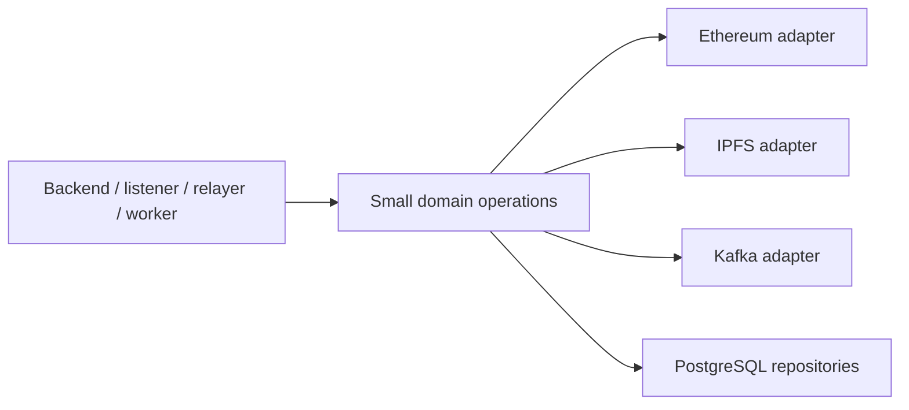

# External integrations

This directory keeps network and persistence technologies behind focused
adapters. Application code asks for a domain operation—such as “load the
selected registry,” “download these claim bytes,” or “save this assessment”—
instead of spreading vendor-specific calls through every process.

## Why the adapter boundary matters

| Integration | Plain-English role | Technical responsibility | Guide |
| --- | --- | --- | --- |
| Ethereum | Select and validate the exact registry deployment | Ignition artifact loading, ABI capability checks, chain ID/code validation and Web3 contract construction | [Ethereum](ethereum/README.md) |
| IPFS | Store and retrieve public canonical claim bytes | Pinata upload, safe pointer parsing, gateway retry and exact byte reads | [IPFS](ipfs/README.md) |
| Kafka | Hand confirmed claims to the asynchronous worker | Versioned envelopes, producer acknowledgements, consumer retry/quarantine and offset control | [Kafka](kafka/README.md) |
| PostgreSQL | Persist retry-safe off-chain state | Connections, migrations, repositories, transactions, advisory locks and deployment-scoped queries | [PostgreSQL](postgres/README.md) |

## Dependency direction

Tests replace network clients or run against disposable local services. This
keeps business rules testable without weakening the real adapter's validation.

## Security rule

An adapter receives only the capability needed by its caller. For example, the
listener gets public Ethereum/IPFS reads and Kafka publication, while FastAPI
gets IPFS upload but no gas-paying key. Sharing an adapter package does not mean
sharing credentials between processes.

Start with the [root architecture](../../README.md#component-responsibilities)
for the full request-to-assessment flow.
