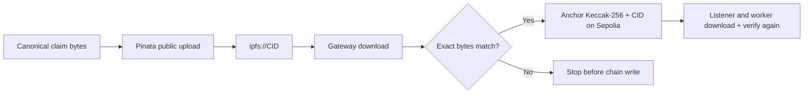

# IPFS integration

`IPFSClient` gives the application one small interface for public claim bytes.
Pinata handles uploads; a configurable HTTP gateway handles reads.

## Quick mental model

IPFS is the **public document layer**, while Sepolia is the **public integrity
anchor**. The CID tells clients where to ask for bytes; the on-chain Keccak-256
hash tells them whether the returned bytes are exactly the authorized claim.

| Process | Allowed IPFS capability |
| --- | --- |
| FastAPI | Upload canonical bytes, read them back, and compare before preparation succeeds |
| Listener | Read event-referenced bytes and compare them before Kafka publication |
| Scoring worker | Read the same bytes and verify them again before feature extraction |
| Frontend | Open a public gateway link from a receipt; never receive the Pinata JWT |

These repeated reads are deliberate trust checks, not redundant downloads.
Neither a CID nor a hash encrypts data.

## Byte-integrity flow



The pointer is gateway-neutral. Callers store `ipfs://<CID>` and the adapter
converts only a safe, bare CID into a gateway URL. Newly uploaded content is
retried briefly because a gateway may not expose it immediately.

## Public interface

| Operation | Behaviour |
| --- | --- |
| `upload_bytes` | Upload exact bytes and return the CID |
| `download_pointer` | Validate an `ipfs://` pointer, download bytes, and retry transient reads |
| `pointer_to_gateway_url` | Convert a safe CID without allowing arbitrary URLs or paths |

FastAPI requires upload and read access. The listener and scoring worker are
read-only and do not receive `PINATA_JWT`.

## Configure

```bash
cp .env.example .env.local
set -a
source .env.local
set +a
```

| Setting | Required | Purpose |
| --- | :---: | --- |
| `PINATA_JWT` | Upload only | Server-side Pinata Files credential |
| `IPFS_GATEWAY` | No | Read gateway; defaults to Pinata's public gateway |

Never expose the JWT through a `VITE_` variable or commit it.

## Test

```bash
source apps/backend/.venv/bin/activate
python -m pytest packages/integrations/ipfs/tests -q
```

Tests inject a fake HTTP session; no public upload or gateway call is made.

## Privacy boundary

```text
CID = address, not password
hash = integrity, not confidentiality
```

Anyone who learns the CID can request the unencrypted bytes while an IPFS node
provides them. Real claim data would require encryption before upload, managed
off-chain keys, access auditing, malware controls, and retention/deletion rules.

See the [backend guide](../../../apps/backend/README.md) and the
[root data map](../../../README.md#what-is-stored-where).
