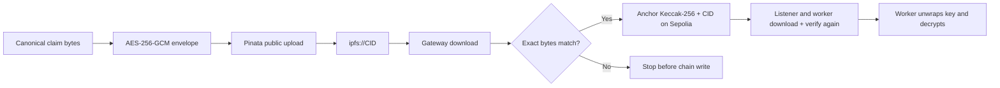

# IPFS integration

`IPFSClient` gives the application one small interface for public opaque bytes.
Pinata handles uploads; a configurable HTTP gateway handles reads. Current
claim writers pass a versioned encrypted envelope rather than plaintext JSON.

## Byte-integrity flow



The pointer is gateway-neutral. Callers store `ipfs://<CID>` and the adapter
converts only a safe, bare CID into a gateway URL. Newly uploaded content is
retried briefly because a gateway may not expose it immediately.

## Public interface

| Operation | Behaviour |
| --- | --- |
| `upload_bytes` | Upload exact bytes and return the CID |
| `download_pointer` | Validate an `ipfs://` pointer, download bytes, and retry transient reads |
| `pointer_to_gateway_url` | Convert a safe CID without allowing arbitrary URLs or paths |

FastAPI requires upload and read access. The listener and scoring worker are
read-only and do not receive `PINATA_JWT`.

## Configure

```bash
cp .env.example .env.local
set -a
source .env.local
set +a
```

| Setting | Required | Purpose |
| --- | :---: | --- |
| `PINATA_JWT` | Upload only | Server-side Pinata Files credential |
| `IPFS_GATEWAY` | No | Read gateway; defaults to Pinata's public gateway |
| `CLAIM_ENCRYPTION_PROVIDER` | Writer + worker | `local` for development or `gcp-kms` for production |
| `CLAIM_ENCRYPTION_ACTIVE_KEY_ID` | Local only | ID used for newly wrapped per-claim data keys |
| `CLAIM_ENCRYPTION_LOCAL_KEYS_JSON` | Local only | Base64-encoded 32-byte development wrapping-key ring |
| `CLAIM_ENCRYPTION_GCP_KMS_KEY` | Production | Full Google Cloud KMS CryptoKey resource name |

Never expose the JWT through a `VITE_` variable or commit it.

## Test

```bash
source apps/backend/.venv/bin/activate
python -m pytest packages/integrations/ipfs/tests -q
```

Tests inject a fake HTTP session; no public upload or gateway call is made.

## Privacy boundary

```text
CID = address, not password
hash = integrity, not confidentiality
```

Anyone who learns the CID can request the encrypted envelope while an IPFS node
provides it. Confidentiality therefore depends on the wrapping key, not on the
CID. Production mode rejects environment-held local wrapping keys and requires
Google Cloud KMS. Existing envelopes retain their key ID so keys can be rotated
without rewriting the chain anchor; old key versions must remain decryptable
for the applicable retention period.

Encryption does not solve authorization, malware handling, legal retention,
key-destruction policy, or access auditing. Those controls still belong around
the insurer's evidence and KMS systems. The IPFS adapter remains deliberately
payload-agnostic so only the privacy module owns cryptographic policy.

See the [backend guide](../../../apps/backend/README.md) and the
[root data map](../../../README.md#what-is-stored-where).
