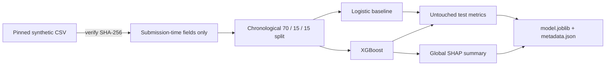
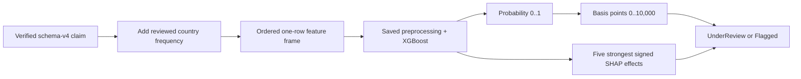

# Fraud-screening model

This package has two paths: a reproducible research training pipeline and a
small serving adapter used by the Kafka worker. Only the reviewed XGBoost
artifact is served; logistic regression remains an evaluation baseline.

> The dataset is synthetic. The result is a research integration signal, not a
> real fraud finding or claim decision.

## Training path



The threshold is selected on validation F1, never on the test period. The first
complete run found that XGBoost did **not** outperform the simpler baseline on
PR-AUC or fraud F1; that honest negative result is recorded in
[RESULTS.md](RESULTS.md).

## Model inputs

| Numeric | Categorical |
| --- | --- |
| Vehicle age | Country |
| Claim amount | Vehicle type |
| Policy premium | Claim type |
| Market claim frequency | Urban or rural region |
| Third-party injury flag | |
| Total-loss flag | |

Settlement amounts, processing duration, generated fraud probability, loss
ratio, and scenario are excluded because they happen after submission or reveal
how the synthetic label was generated.

## Train the artifact

From the repository root:

```bash
source apps/backend/.venv/bin/activate
python -m pip install --require-hashes -r requirements-dev.lock
python -m packages.model.train_xgboost --download
```

On macOS, install OpenMP once if XGBoost cannot find it:

```bash
brew install libomp
```

Generated files are ignored by Git and written under:

```text
packages/model/artifacts/xgboost-african-motor-v1/
├── model.joblib       fitted preprocessing + XGBoost pipeline
├── metadata.json      checksum, features, threshold, metrics and references
└── shap-summary.png   global research explanation
```

The downloader pins both the dataset revision and expected digest. The serving
adapter verifies `model.joblib` before loading it; joblib files must never come
from a user or untrusted storage because deserialization can execute code.

## Serving path



The country frequency comes from reviewed artifact metadata, not the browser.
The scorer returns one stable `FraudScore` containing:

- raw probability;
- basis-point value for Solidity;
- reviewed threshold and model version;
- `flagged` as a screening result; and
- five readable, claim-specific SHAP reasons.

Example conversion:

```text
probability 0.2466 -> 24.66% -> 2,466 / 10,000 on-chain
```

## Reading SHAP reasons

| Sign | Plain meaning |
| --- | --- |
| Positive | This feature moved this model prediction toward higher modelled risk |
| Negative | This feature moved this model prediction toward lower modelled risk |
| Larger absolute value | Stronger influence relative to this claim's other features |

SHAP explains the model's calculation for one claim. It does not prove cause,
fraud, or innocence. One-hot categories may appear as `Country: Ghana` or
`Country is not Kenya` because the model receives separate yes/no columns.

## Application configuration

| Setting | Purpose |
| --- | --- |
| `XGBOOST_MODEL_DIR` | Directory containing the reviewed files |
| `XGBOOST_MODEL_SHA256` | Optional deployment-level checksum override |

The intended entry point is the asynchronous worker:

```bash
python -m packages.integrations.kafka.scoring_worker
```

## Verify

```bash
source apps/backend/.venv/bin/activate
python -m pytest packages/model/tests -q
```

Tests cover leakage controls, chronological splitting, artifact integrity,
feature compatibility, scoring, and local SHAP output.

## Notebooks

The notebooks call the tested functions in `research_pipeline.py` instead of
maintaining a second training implementation:

- [Dataset exploration](notebooks/01_dataset_exploration.ipynb)
- [XGBoost and SHAP](notebooks/02_xgboost_and_shap.ipynb)

See the [notebook guide](notebooks/README.md) and the
[Kafka guide](../integrations/kafka/README.md).
